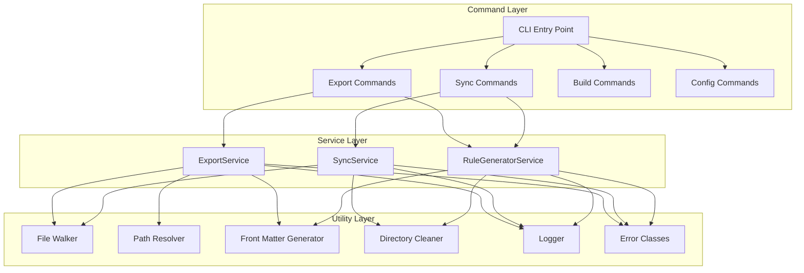
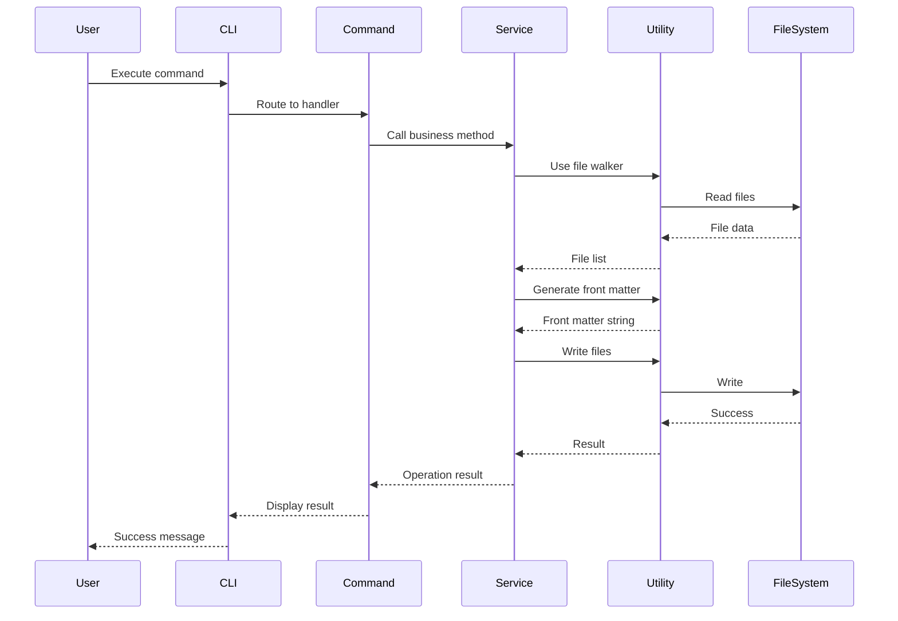

# Architecture Documentation

## Overview

The `.scripts` project is a TypeScript CLI tool for managing AI prompt engineering workflows. It provides commands for compiling, exporting, and synchronizing prompt files across different AI tools (Cursor, Claude Code, Kiro, Qoder, Codebuddy).

This document describes the three-layer architecture that organizes the codebase for maintainability, testability, and extensibility.

## Three-Layer Architecture

The project follows a strict three-layer architecture with unidirectional dependencies:

```
Command Layer → Service Layer → Utility Layer
```

### Architecture Diagram



## Layer Responsibilities

### 1. Command Layer (`src/commands/`)

**Purpose**: Handle CLI interactions and orchestrate service calls

**Responsibilities**:
- Parse command-line arguments
- Display progress and user feedback
- Handle errors and set exit codes
- Call service layer methods
- Manage logger lifecycle

**What NOT to do**:
- Implement business logic
- Directly manipulate files
- Contain complex algorithms

**Example Structure**:
```typescript
export async function kiroExportCommand(): Promise<void> {
  const log = getLogger()
  
  try {
    // CLI interaction only
    log.info('Starting Kiro export...')
    
    // Delegate to service layer
    const service = new ExportService()
    const result = await service.exportToKiro({
      sourcePath: process.cwd(),
      targetPath: '.kiro/steering',
      frontMatterType: FrontMatterType.KIRO_ALWAYS
    })
    
    // Display results
    log.info('Exported {} files', result.exported)
  } catch (error) {
    // Error handling
    log.error('Export failed: {}', error)
    process.exitCode = 1
  } finally {
    // Cleanup
    await log.shutdown()
  }
}
```

### 2. Service Layer (`src/services/`)

**Purpose**: Implement core business logic and coordinate utilities

**Responsibilities**:
- Implement business workflows
- Coordinate multiple utility functions
- Provide reusable business operations
- Handle business-level errors
- Log business operations

**What NOT to do**:
- Handle CLI interactions
- Directly use console.log
- Depend on other services (prefer composition)

**Key Services**:

#### ExportService
Handles exporting AGENTS.md files to different targets with appropriate front matter.

```typescript
class ExportService {
  async exportToKiro(options: ExportOptions): Promise<ExportResult>
  async exportToQoder(options: ExportOptions): Promise<ExportResult>
  async exportAgentsFiles(options: ExportOptions): Promise<ExportResult>
}
```

#### RuleGeneratorService
Generates rule files with front matter from source files.

```typescript
class RuleGeneratorService {
  async generateRuleFile(options: RuleGenerationOptions): Promise<boolean>
  async batchGenerateRules(files: string[], options: RuleGenerationOptions): Promise<RuleGenerationResult>
}
```

#### SyncService
Synchronizes files and directories between locations.

```typescript
class SyncService {
  async syncDirectory(options: SyncOptions): Promise<SyncResult>
  async syncAgentsToClaude(basePath: string): Promise<SyncResult>
  async syncSkills(sourcePath: string, targets: string[]): Promise<SyncResult>
}
```

### 3. Utility Layer (`src/utils/`)

**Purpose**: Provide low-level, reusable functionality

**Responsibilities**:
- File system operations
- Path calculations
- String transformations
- Logging infrastructure
- Error definitions

**What NOT to do**:
- Implement business logic
- Maintain state (should be stateless)
- Depend on services or commands

**Key Utilities**:

#### File Walker
Recursively finds files matching specific criteria.

```typescript
async function findFiles(options: FileWalkerOptions): Promise<FileInfo[]>
```

#### Path Resolver
Calculates relative paths, glob patterns, and unique filenames.

```typescript
function calculateRelativePath(options: PathCalculationOptions): string
function calculateGlobPattern(options: PathCalculationOptions): string
function generateUniqueFileName(options: PathCalculationOptions): string
```

#### Front Matter Generator
Generates YAML front matter for different target systems.

```typescript
function generateFrontMatter(options: FrontMatterOptions): string
function addFrontMatter(content: string, frontMatter: string): string
function removeBom(content: string): string
```

## Dependency Rules

### Unidirectional Dependencies

Each layer can only depend on layers below it:

```
✅ Command → Service → Utility
❌ Utility → Service
❌ Service → Command
❌ Utility → Command
```

### Within-Layer Dependencies

- **Commands**: Can call multiple services, but should not depend on other commands
- **Services**: Can use multiple utilities, but should avoid depending on other services (prefer composition)
- **Utilities**: Should be completely independent of each other when possible

## Data Flow

### Typical Request Flow



## Error Handling Strategy

### Error Hierarchy

```typescript
ScriptsError (base)
├── FileSystemError
├── ConfigurationError
└── ProcessingError
```

### Error Flow

1. **Utility Layer**: Throws specific errors with context
2. **Service Layer**: Catches utility errors, adds business context, re-throws or handles
3. **Command Layer**: Catches all errors, logs them, sets exit codes

### Example

```typescript
// Utility layer
if (!fs.existsSync(path)) {
  throw new FileSystemError('File not found', path)
}

// Service layer
try {
  await utility.readFile(path)
} catch (error) {
  if (error instanceof FileSystemError) {
    log.error('Failed to read source file: {}', error.message)
    throw new ProcessingError('Export failed', { path, reason: error.message })
  }
  throw error
}

// Command layer
try {
  await service.export(options)
} catch (error) {
  log.error('Command failed: {}', error)
  process.exitCode = 1
}
```

## Configuration Management

### Centralized Constants

All configuration is centralized in `src/constants/`:

- `paths.ts`: File paths and directory locations
- `templates.ts`: Front matter templates
- `index.ts`: Re-exports for convenient access

### Usage

```typescript
import { PATHS, TEMPLATES } from '@/constants'

const steeringDir = PATHS.KIRO_STEERING
const frontMatter = TEMPLATES.KIRO_ALWAYS
```

## Testing Strategy

### Test Organization

Tests are co-located with source files using the `__tests__` directory pattern:

```
src/
├── services/
│   ├── export/
│   │   ├── ExportService.ts
│   │   └── __tests__/
│   │       ├── ExportService.test.ts
│   │       └── ExportService.property.test.ts
```

### Test Types

1. **Unit Tests** (`.test.ts`): Test individual functions and classes
2. **Property Tests** (`.property.test.ts`): Test universal properties using fast-check
3. **Integration Tests** (`.integration.test.ts`): Test end-to-end command execution

### Testing Each Layer

#### Utility Layer
- Focus on pure function behavior
- Test edge cases and error conditions
- Use property-based testing for mathematical properties

#### Service Layer
- Mock file system operations
- Test business logic flows
- Verify error handling

#### Command Layer
- Integration tests with real file system
- Test CLI interactions
- Verify exit codes and logging

## Extension Points

### Adding a New Command

1. Create command file in `src/commands/<domain>/<action>.ts`
2. Implement command function following the pattern
3. Register in `src/cli.ts`
4. Add integration test in `src/commands/__tests__/`

### Adding a New Service

1. Create service class in `src/services/<name>/`
2. Define clear interfaces for options and results
3. Use existing utilities, avoid creating new ones if possible
4. Add unit tests in `__tests__/` subdirectory

### Adding a New Utility

1. Create utility file in `src/utils/<name>.ts`
2. Keep functions pure and stateless
3. Add comprehensive unit tests
4. Consider property-based tests for mathematical properties

## Best Practices

### Do's

- ✅ Keep layers strictly separated
- ✅ Use dependency injection for testability
- ✅ Log at appropriate levels (info, debug, error)
- ✅ Handle errors explicitly with context
- ✅ Write tests for new functionality
- ✅ Use TypeScript types strictly

### Don'ts

- ❌ Mix business logic in command layer
- ❌ Access file system directly from commands
- ❌ Create circular dependencies
- ❌ Suppress errors without logging
- ❌ Use console.log (use logger instead)
- ❌ Duplicate code across layers

## Migration Notes

This architecture was established during a refactoring effort to address:

- Code duplication across commands
- Mixed responsibilities in command files
- Lack of testability
- Scattered configuration

The refactoring maintained backward compatibility while improving internal structure. All existing commands continue to work with the same CLI interface.
