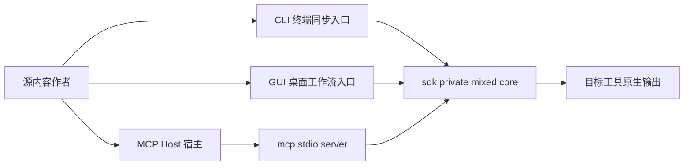

# 快速指引

这一节不展开实现细节，只解决一件事：你现在应该先读哪条路径，才能最快进入可执行状态。

## 架构速览

这张图只强调当前 repo 的消费方向：`sdk/` 是单一核心层，`cli/`、`gui/`、`mcp/` 都围绕它工作，不是各自维护一套并行真源。

## 先判断你的目标

| 你的目标 | 应该进入哪里 | 为什么 |
| --- | --- | --- |
| 在终端里同步 prompts、rules、skills、commands 或项目记忆 | [CLI](/docs/cli) | 当前真实操作入口、Schema、输出范围与清理边界都在这里核对 |
| 在桌面应用里编辑配置、触发执行、观察日志 | [GUI](/docs/gui) | `gui/` 负责桌面工作流，但核心执行仍然依赖 `sdk/` 中的 `tnmsc` crate |
| 把 `memory-sync-mcp` 接到支持 MCP 的宿主 | [MCP](/docs/mcp) | 这里单独说明 stdio server、工具清单与 `workspaceDir` 约束 |
| 先搞清 repo 内部架构分层，而不是马上使用 | [SDK](/docs/sdk) 与 [技术细节](/docs/technical-details) | 前者说明 mixed core 的边界，后者说明真源模型与同步管线 |

## 快速安装

如果你现在先想把命令装起来，再决定后面走 CLI、GUI 还是 MCP，直接看 [快速安装](/docs/quick-guide/quick-install)。

## 最短起步路径

### 如果你走 CLI

1. 先看 [安装与前提](/docs/cli/install)。
2. 再看 [项目与 aindex](/docs/cli/workspace-setup)。
3. 然后用 [第一次同步](/docs/cli/first-sync) 跑通一次真实流程。

### 如果你走 GUI

1. 先看 [GUI 概览](/docs/gui)。
2. 再看 [页面与工作流](/docs/gui/workflows-and-pages)。
3. 涉及命令、输出范围或清理边界时，回到 [CLI](/docs/cli) 核对事实。

### 如果你走 MCP

1. 先看 [MCP 概览](/docs/mcp)。
2. 再看 [Server 与 Tools](/docs/mcp/server-tools)。
3. 需要准备项目目录、理解 Schema 或输出边界时，回到 [CLI](/docs/cli)。

## 进入前先记住三件事

- `sdk/` 是 repo 内部 mixed core，`cli/`、`mcp/`、`gui/` 都是消费者，不是平行真源。
- 当前公开文档以仓库现状为准；如果旧页面、README 和代码冲突，以实际目录、命令表面和 Schema 为准。
- 不确定入口时，优先从这页分流，而不是先翻实现细节。
