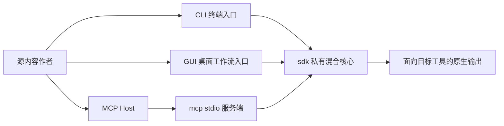

# 快速指南

这一部分不深入实现细节，只回答一个问题：为了尽快进入可用状态，你应该先读哪条路径？

## 架构一览

这张图只强调当前的依赖方向：`sdk/` 是唯一的核心层，`cli/`、`gui/` 和 `mcp/` 都围绕它工作，而不是各自维护平行的事实来源。

## 先确定你的目标

| 你的目标 | 去哪里 | 原因 |
| --- | --- | --- |
| 在终端里运行 `tnmsc install` 来分发 prompts、rules、skills、commands 或 project memory | [CLI](/docs/cli) | 真实的命令界面、schema、输出范围和清理边界都在那里核实。 |
| 在桌面应用里编辑配置、触发 install 并查看日志 | [GUI](/docs/gui) | `gui/` 负责桌面工作流，但 install 仍依赖 `sdk/` 中的 `tnmsc` crate。 |
| 把 `memory-sync-mcp` 连接到支持 MCP 的宿主 | [MCP](/docs/mcp) | 这一部分重点说明 stdio 服务端、工具列表和 `workspaceDir` 语义。 |
| 在使用任何东西之前先理解仓库架构 | [SDK](/docs/sdk) 和 [技术细节](/docs/technical-details) | 前者解释混合核心边界，后者解释事实来源模型和同步流水线。 |

## 快速安装

如果你想先把命令装好，之后再决定使用 CLI、GUI 还是 MCP，直接去看 [快速安装](/docs/quick-guide/quick-install)。

## 一页看完配置准备

如果你需要了解 `.aindex` 和 `~/.aindex/.tnmsc.json` 的真实准备方式与配置事实，请看 [aindex 与 `.tnmsc.json`](/docs/quick-guide/aindex-and-config)。这页把准备路径、配置位置、当前支持的用户字段和固定的 aindex 布局都汇总在一起。

## 最短起步路径

### 如果你从 CLI 开始

1. 阅读 [安装与要求](/docs/cli/install)。
2. 接着看 [aindex 与 `.tnmsc.json`](/docs/quick-guide/aindex-and-config)。
3. 然后使用 [第一次安装流程](/docs/cli/first-sync) 实际跑通一次完整流程。

### 如果你从 GUI 开始

1. 阅读 [GUI 概览](/docs/gui)。
2. 接着看 [工作流与页面](/docs/gui/workflows-and-pages)。
3. 当你需要理解命令行为、输出范围或清理边界时，再回到 [CLI](/docs/cli) 查看权威说明。

### 如果你从 MCP 开始

1. 阅读 [MCP 概览](/docs/mcp)。
2. 接着看 [服务端与工具](/docs/mcp/server-tools)。
3. 如果你需要项目准备、schema 细节或输出边界，就回到 [CLI](/docs/cli)。

## 开始前要记住的三件事

- `sdk/` 是仓库内部的混合核心。`cli/`、`mcp/` 和 `gui/` 都是消费方，不是平行的事实来源。
- 公共文档以当前仓库为准。如果旧页面、README 和代码彼此不一致，请相信真实目录、命令界面和 schema。
- 如果你不确定从哪里开始，先用这页分流，不要随机打开实现细节。
