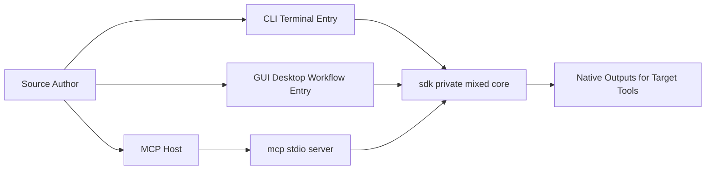

# Quick Guide

This section does not dive into implementation details. It answers one question only: which path should you read first to get to a working state as quickly as possible?

## Architecture at a Glance

This diagram highlights the current dependency direction only: `sdk/` is the single core layer, and `cli/`, `gui/`, and `mcp/` all work around it instead of maintaining parallel sources of truth.

## Decide Your Goal First

| Your Goal | Where to Go | Why |
| --- | --- | --- |
| Sync prompts, rules, skills, commands, or project memory from a terminal | [CLI](/docs/cli) | The real command surface, schema, output scopes, and cleanup boundaries are all verified there. |
| Edit config, trigger execution, and inspect logs from the desktop app | [GUI](/docs/gui) | `gui/` owns the desktop workflow, but execution still depends on the `tnmsc` crate in `sdk/`. |
| Connect `memory-sync-mcp` to an MCP-capable host | [MCP](/docs/mcp) | That section focuses on the stdio server, the tool list, and `workspaceDir` semantics. |
| Understand the repo architecture before using anything | [SDK](/docs/sdk) and [Technical Details](/docs/technical-details) | The first explains the mixed-core boundary, and the second explains the source-of-truth model and the sync pipeline. |

## Quick Install

If you want to install the command first and decide between CLI, GUI, and MCP later, go straight to [Quick Install](/docs/quick-guide/quick-install).

## Config Setup in One Page

If you need the real setup and config facts for `.aindex` and `~/.aindex/.tnmsc.json`, use [aindex and `.tnmsc.json`](/docs/quick-guide/aindex-and-config). That page now collects the setup path, config location, field meanings, defaults, and `tnmsc config` key whitelist in one place.

## Shortest Starting Paths

### If You Start with CLI

1. Read [Installation and Requirements](/docs/cli/install).
2. Continue with [aindex and `.tnmsc.json`](/docs/quick-guide/aindex-and-config).
3. Then use [First Sync](/docs/cli/first-sync) to run through the real flow once.

### If You Start with GUI

1. Read the [GUI Overview](/docs/gui).
2. Continue with [Workflows and Pages](/docs/gui/workflows-and-pages).
3. When command behavior, output scopes, or cleanup boundaries matter, go back to [CLI](/docs/cli) for the authoritative details.

### If You Start with MCP

1. Read the [MCP Overview](/docs/mcp).
2. Continue with [Server and Tools](/docs/mcp/server-tools).
3. If you need project setup, schema details, or output boundaries, go back to [CLI](/docs/cli).

## Three Things to Remember Before You Dive In

- `sdk/` is the internal mixed core of the repo. `cli/`, `mcp/`, and `gui/` are consumers, not parallel sources of truth.
- The public docs follow the current repository. If old pages, the README, and the code disagree, trust the actual directories, command surface, and schema.
- If you are unsure where to begin, use this page to branch first instead of opening implementation details at random.
