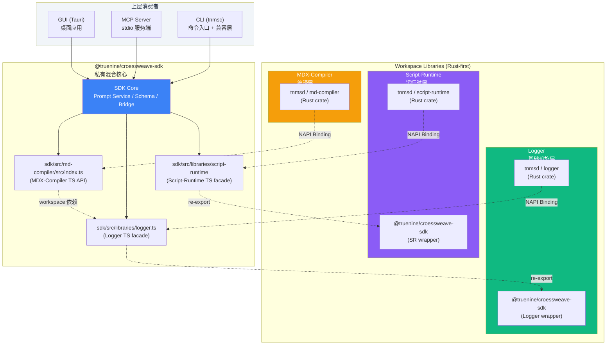
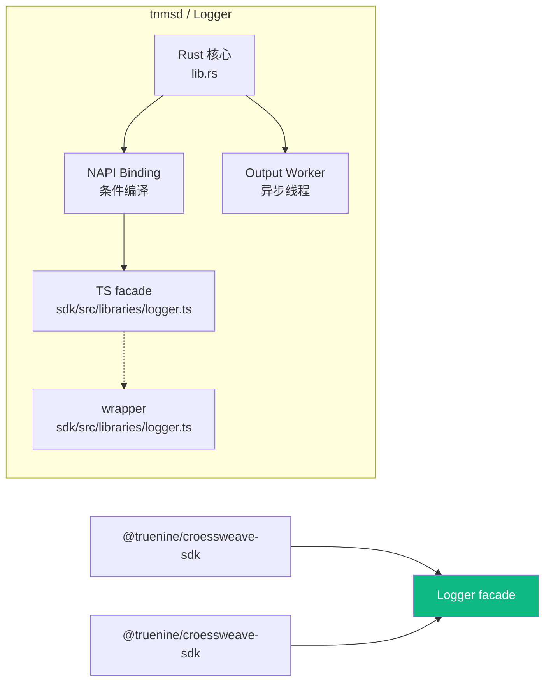
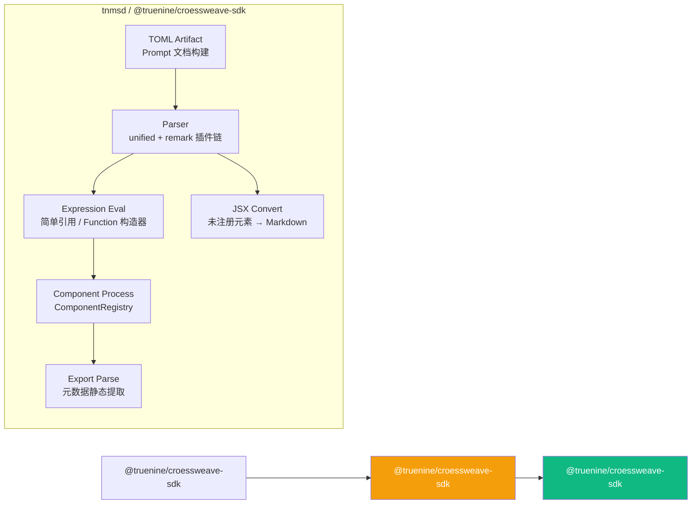
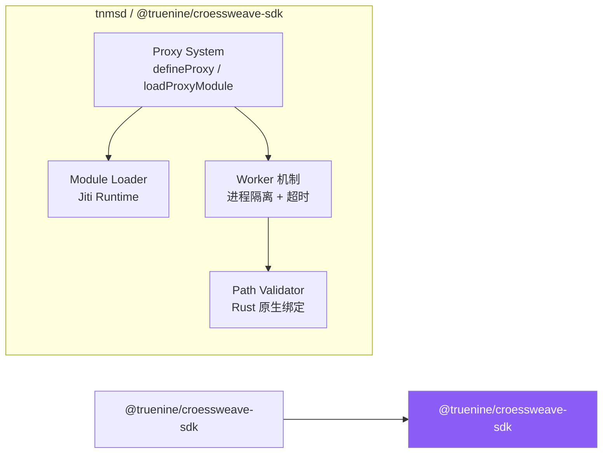
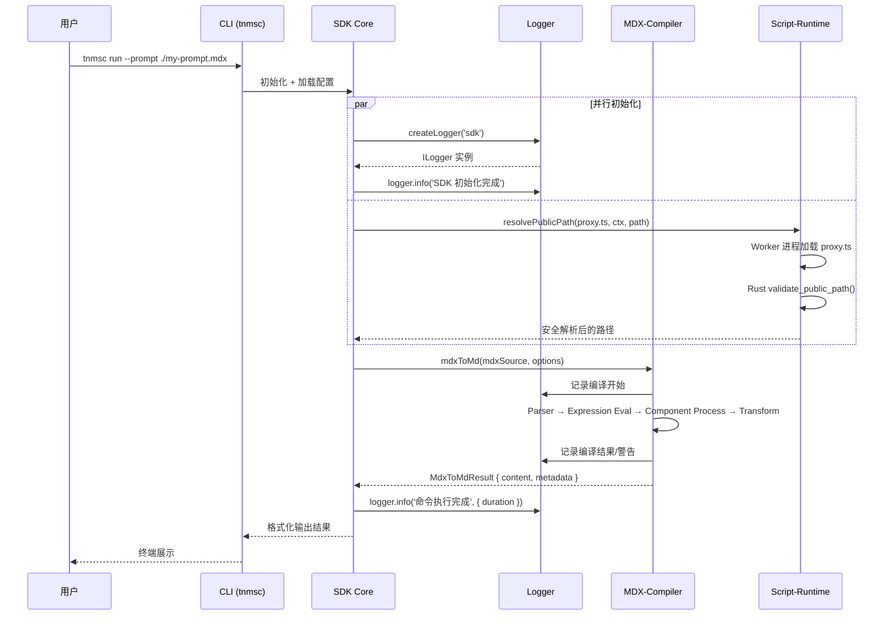
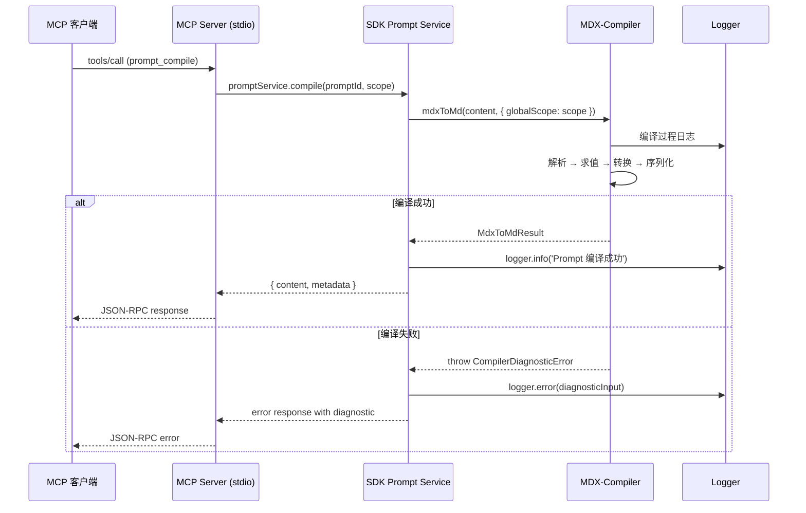

import { Callout, Cards, Steps, Tabs } from 'nextra/components'

# SDK 架构总览

本文档从全局视角呈现 `sdk/` 作为私有混合核心的完整架构，整合 [Logger](/docs/sdk/logger)、[MDX-Compiler](/docs/sdk/md-compiler)、[Script-Runtime](/docs/sdk/script-runtime) 三个基础库的职责边界与协作关系。

## SDK 整体定位

`sdk/` 是整个 croessweave monorepo 的 **私有混合核心（Private Mixed Core）**，也是共享内部能力的唯一事实来源。它不是一个供外部直接安装的独立 npm 包——它的存在是为了将 croessweave 工具链的核心逻辑从 `cli/` 命令入口层中抽离出来，形成清晰的分层架构。

在当前仓库结构中，`sdk/` 承担以下核心职责：

- 拥有 Rust crate `tnmsd` 的实际 workspace 路径和 facade 定义
- 提供 npm 包 `@truenine/croessweave-sdk` 作为内部消费者（`cli/`、`mcp/`、`gui/`）的统一依赖入口
- 负责 Prompt Service 的实现（基于 MDX-Compiler）、Schema 生成以及最小化的 TypeScript loader 入口
- 编排 Logger、MDX-Compiler、Script-Runtime 三类基础能力；其中 Logger / Script-Runtime 的 TypeScript facade 已内联到 `sdk/src/libraries/*`，`sdk/*` 保留 Rust crate 与发布壳层

**消费者依赖方向**是单向的：`cli/`、`mcp/`、`gui/` 都依赖 `sdk/`。在 `sdk/` 下游，MDX-Compiler 仍完整保留在 `sdk/`，而 Logger / Script-Runtime 已形成"`sdk/src/libraries/*` 作为 TypeScript 事实来源 + `sdk/*` 作为 Rust crate / wrapper 发布层"的分层。这种边界确保了核心逻辑不会散落在多个入口中，也避免了 `cli/` 再次成为隐式的事实来源。

## 为什么还保留 Libraries 层

`sdk/` 仍然有存在价值，但它现在主要承载 **Rust-first** 的 crate、本地 NAPI 制品和对外发布 wrapper，而不再默认承担全部 TypeScript 事实来源。它们覆盖了 croessweave 工具链中性能最关键的路径：

| 性能关键路径 | 对应 Library | Rust 提供的优势 |
| --- | --- | --- |
| 日志格式化与输出 | Logger | 零拷贝字符串处理、异步 output worker 线程、原子级别控制 |
| MDX 解析与转换 | MDX-Compiler | 原生 AST 遍历、零成本抽象的编译器流水线 |
| 路径规范化与安全验证 | Script-Runtime | OS 级路径遍历防护、进程隔离的超时控制 |

将这些能力下沉到独立的 Rust crate 中，使得 `gui/`（Tauri 应用）可以直接调用 crate 而无需 NAPI 开销，同时也让每个库可以独立演进和测试。当前只有 Logger / Script-Runtime 的 TypeScript facade 回收到了 `sdk/src/libraries/*`；`md-compiler` 仍完整保留在 `sdk/`。

---

## 三库角色定位



<Cards>
  <Cards.Card title="Logger — 基础设施层" href="/docs/sdk/logger" icon="📝">
    所有其他库和 SDK 直接依赖的基础设施。提供 AI 友好的 Markdown 结构化日志输出、诊断错误格式化、诊断缓冲机制和异步 Output Worker。是整个工具链的"神经系统"。
  </Cards.Card>
  <Cards.Card title="MDX-Compiler — 编译层" href="/docs/sdk/md-compiler" icon="⚙️">
    依赖 Logger 进行编译过程日志。提供 MDX→Markdown 转换引擎、表达式求值、JSX 组件注册/处理、导出元数据提取以及 TOML artifact 构建。是 Prompt Service 的核心引擎。
  </Cards.Card>
  <Cards.Card title="Script-Runtime — 运行时层" href="/docs/sdk/script-runtime" icon="🚀">
    独立于其他库。提供代理模块动态加载（Jiti 运行时）、Rust 原生路径安全验证、Worker 进程隔离执行。独立的原因：职责域不同（运行时加载 vs 编译期转换），且路径安全属于安全敏感操作。
  </Cards.Card>
</Cards>

---

## 依赖关系详解

### Logger — 基础设施层

Logger 是整个依赖树的 **叶子节点之一**（另一个是 Script-Runtime），不依赖任何其他 workspace library。当前 `sdk/src/native_logger.rs` 是 Rust 事实来源，而 `sdk/src/libraries/logger.ts` 保留对外发布的 TypeScript facade。



**提供的能力**：

| 能力 | 说明 |
| --- | --- |
| 结构化日志输出 | 以 `### Title` + Markdown 列表格式输出，天然适合 AI 解析 |
| 诊断错误格式 | `error`/`warn`/`fatal` 级别支持 rootCause、exactFix、possibleFixes、details 四个语义区域 |
| 诊断缓冲机制 | Silent 模式下诊断仍被缓冲到全局队列，可通过 `drainBufferedDiagnostics()` 批量提取 |
| 异步 Output Worker | 通过 `mpsc::channel` 驱动的独立输出线程，避免 I/O 阻塞主线程 |
| NAPI 跨平台绑定 | 条件编译 `#[cfg(feature = "napi")]`，支持 win32/linux/darwin 五大平台 |

**被谁依赖**：SDK 本身（ConfigLoader、RuntimeEnvironment 使用 logger 输出配置和运行时信息）、MDX-Compiler（编译过程中的日志记录）。

> 详细 API 参考 → [Logger 日志库](/docs/sdk/logger)

### MDX-Compiler — 编译层

MDX-Compiler 位于依赖树的中层，**仅依赖 Logger**，被 SDK 的 Prompt Service 直接使用。



**提供的能力**：

| 能力 | 说明 |
| --- | --- |
| MDX → Markdown 转换 | 将包含 JSX、表达式插值、ESM 导出的 MDX 编译为标准 Markdown |
| 表达式求值 | 受控作用域内的 JS 表达式求值（简单引用直接查找，复杂表达式用 `new Function()`） |
| JSX 组件处理 | 通过 ComponentRegistry 注册和处理内置/自定义组件（如 `<Md>` 条件渲染） |
| 导出元数据解析 | 从 `export const` / `export default` 中静态提取 frontmatter 字段 |
| TOML Artifact 构建 | 为 Prompt 工程场景构建结构化的 TOML 文档 |

**为什么依赖 Logger**：编译过程的各个阶段（Parser、Expression Eval、Component Process 等）需要结构化日志来输出编译进度、警告和诊断错误。这些日志通过 Logger 的 Markdown 格式输出，确保终端可读且 AI 可解析。

**运行时结构**：公开包入口默认使用 Native Binding（Rust/NAPI）；`src/compiler/` 保留 TypeScript 参考流水线，用于源级测试、调试和实现对照。

> 详细 API 参考 → [MDX-Compiler 编译器](/docs/sdk/md-compiler)

### Script-Runtime — 运行时层

Script-Runtime 是依赖树中的 **另一个叶子节点**，与其他两个 library **无依赖关系**。



**提供的能力**：

| 能力 | 说明 |
| --- | --- |
| 代理模块加载 | 通过 Jiti 运行时动态加载用户定义的 `proxy.ts`，支持 TS/ESM 语法 |
| 路径安全验证 | Rust 原生绑定实现的防路径遍历严格验证（normalize_path + ensure_within_root） |
| Worker 进程隔离 | 子进程执行代理逻辑，带超时控制（默认 5000ms），防止失控挂起 |
| 代理路由分发 | 支持函数式和对象式两种代理定义模式，含命令匹配器（matcher） |

**为什么独立于其他库**：Script-Runtime 的职责域是 **运行时模块加载和路径安全**，这与 MDX-Compiler 的 **编译期转换** 属于完全不同的阶段。此外，路径验证涉及安全敏感操作（防路径遍历），将其作为独立 crate 可以接受更严格的审计和测试覆盖。Logger 的日志能力对 Script-Runtime 来说不是必需的——它通过 stderr 直接传递错误信息给调用方。

> 详细 API 参考 → [Script-Runtime](/docs/sdk/script-runtime)

---

## 数据流说明

### 场景 1：CLI 执行命令的完整流程

当用户通过 `tnmsc` CLI 执行一条命令时，数据流经所有三层 library：



### 场景 2：MCP Server 处理请求

MCP Server 作为轻量消费者，主要使用 SDK 的 Prompt Service 能力：



---

## 构建流程说明

SDK 的构建是一个多阶段的有序流水线，从 Rust 源码到最终的 npm 制品：

<Steps>
  ### Step 1: Workspace Libraries 构建

  首先并行构建三个 workspace libraries 的 TypeScript 和 Native binding：

  ```bash
  # 显式初始化本地开发环境
  pnpm run bootstrap

  # Rust workspace 构建
  cargo build --workspace --exclude croessweave-gui --release

  # CLI schema 与 npm 包装层
  pnpm -F @truenine/croessweave-cli run build
  ```

  此阶段产出：
  - `sdk/src/native_logger.rs` → `dist/index.js` + `napi-croessweave-cli.*.node`
  - `sdk/src/md-compiler/dist/index.js` + `napi-croessweave-cli.*.node`
  - `sdk/src/libraries/script-runtime/dist/index.js` + `napi-croessweave-cli.*.node`

  ### Step 2: Rust Workspace 编译

  编译 `tnmsd`、CLI、MCP server 与 GUI 对应的 Rust crate：

  ```bash
  cargo build --workspace --exclude croessweave-gui --release
  ```

  此步骤会：
  - 执行统一的 workspace Rust 构建
  - 生成 CLI、MCP 与 GUI 所需的原生产物

  ### Step 3: CLI 包装层装配

  由 CLI crate 负责 schema 导出与 npm 子包装配：

  ```bash
  pnpm -F @truenine/croessweave-cli run build
  ```

  ### Step 4: GUI / Docs 前端构建

  GUI 和 docs 各自在包内维持私有脚本，根目录只负责 monorepo 编排：

  ```bash
  pnpm -C gui build
  pnpm -C doc run build
  ```

  此阶段分别产出 GUI 前端 bundle 与 docs 站点产物。
</Steps>

<Callout type="info">
**构建脚本速查**：当前仓库的权威入口已经收敛到根级 `pnpm run bootstrap`、`pnpm run build`、`pnpm run test` 与各包自己的 `package.json`/`Cargo.toml`。
</Callout>

---

## 代码组织结构

### 目录树

```
croessweave/
├── sdk/                                    # 私有混合核心
│   ├── src/
│   │   ├── index.ts                       # 公共 API 入口
│   │   ├── core/
│   │   │   └── native-binding-loader.ts   # 统一绑定加载器
│   │   ├── libraries/                        # 内联 TypeScript facade
│   │   │   ├── logger.ts                     # Logger TS facade (re-export)
│   │   │   └── script-runtime/               # Script-Runtime TS facade (re-export)
│   │   ├── adaptors/                      # 输出适配器
│   │   ├── prompts.ts                     # Prompt 服务 (使用 md-compiler)
│   │   ├── ConfigLoader.ts                # 配置加载 (使用 logger)
│   │   └── runtime-environment.ts         # 运行时环境 (使用 logger)
│   ├── Cargo.toml                         # Rust crate 定义 (tnmsd)
│   └── Cargo.lock                         # Rust 依赖锁文件
│
├── sdk/src/ 内部库结构                   # Rust-first 内部库
│   ├── libraries/                            # TypeScript facade
│   │   ├── logger.ts                         # Logger TS facade (re-export)
│   │   └── script-runtime/                   # Script-Runtime TS facade (re-export)
│   │
│   ├── md-compiler/                          # 编译器
│   │   ├── compiler/                         # 编译器组件
│   │   │   ├── parser.ts                     # MDX → MDAST (unified)
│   │   │   ├── expression-eval.ts            # 表达式求值
│   │   │   ├── jsx-expression-eval.ts        # JSX 表达式求值
│   │   │   ├── component-processor.ts        # 组件处理器
│   │   │   ├── component-registry.ts         # 组件注册表
│   │   │   ├── export-parser.ts              # 导出元数据解析
│   │   │   ├── jsx-converter.ts              # JSX → Markdown
│   │   │   └── transformer.ts               # AST 转换编排
│   │   ├── components/                       # 内置组件
│   │   │   └── Md.ts                         # <Md> 条件渲染组件
│   │   ├── globals/                          # 全局作用域定义
│   │   ├── toml.ts                           # TOML 构建
│   │   └── errors/                           # 错误类型体系
│   │
│   ├── native_md_compiler/                   # Rust 编译器核心
│   │   ├── lib.rs                            # NAPI compile_mdx_to_md
│   │   ├── parser.rs                         # MDX 解析
│   │   ├── expression_eval.rs                # 表达式求值
│   │   ├── mdx_to_md.rs                      # MDX→MD 转换
│   │   ├── transformer.rs                    # AST 转换
│   │   ├── serializer.rs                     # 序列化
│   │   └── toml_artifact.rs                  # TOML 构建
│   │
│   ├── native_logger.rs                      # Logger Rust 核心
│   └── native_script_runtime.rs              # Script-Runtime Rust 核心
```

### 关键文件职责映射

| 文件 | 所属层 | 核心职责 | 依赖的 Library |
| --- | --- | --- | --- |
| `sdk/src/index.ts` | SDK | 公共 API 入口，re-export 核心能力 | 全部三个 |
| `sdk/src/prompts.ts` | SDK | Prompt Service，编译和管理 prompts | MDX-Compiler, Logger |
| `sdk/src/ConfigLoader.ts` | SDK | 配置文件加载与验证 | Logger, Zod |
| `sdk/src/runtime-environment.ts` | SDK | 运行时环境初始化 | Logger |
| `sdk/src/core/native-binding-loader.ts` | SDK | 统一的 NAPI binding 加载（消除重复） | — |
| `sdk/src/libraries/logger.ts` | SDK | Logger TypeScript facade、`ILogger` 适配器、共享加载器接入 | Logger Rust crate |
| `sdk/src/libraries/script-runtime/index.ts` | SDK | Script-Runtime TypeScript facade、Worker 路径发现、共享加载器接入 | Script-Runtime Rust crate |
| `sdk/src/libraries/script-runtime/runtime-core.ts` | SDK | Jiti 加载、代理路由分发 | — |
| `sdk/src/native_logger.rs` | Logger | Rust 核心：日志级别、格式化、诊断、OutputWorker | — |
| `sdk/src/libraries/logger.ts` | Logger | 发布 wrapper：re-export Logger facade | — |
| `sdk/src/md-compiler/compiler/` | MDX-Compiler | 编译器流水线全组件 | Logger (workspace) |
| `sdk/src/md-compiler/native-binding.ts` | MDX-Compiler | 共享加载器接入、env flag gate、binding validator | — |
| `sdk/src/native_script_runtime.rs` | Script-Runtime | Rust 核心：路径验证、Worker 管理 | — |
| `sdk/src/libraries/script-runtime/index.ts` | Script-Runtime | 发布 wrapper：re-export Script-Runtime facade | — |

---

## 设计决策与权衡

### 为什么选择 Rust-first？

<Callout type="info">
**核心论点**: 性能关键路径上的操作应当在 Rust 中实现，而非 JavaScript。
</Callout>

| 操作 | JS 实现瓶颈 | Rust 实现优势 |
| --- | --- | --- |
| 日志格式化 | 大量字符串拼接、V8 GC 压力 | 零拷贝切片、栈分配 buffer |
| MDX AST 遍历 | V8 对象属性访问开销大 | 结构体直接访问、无 GC |
| 路径规范化 | 正则表达式逐段处理 | 单次遍历、无回溯 |
| 进程管理 | `child_process` 抽象层开销 | 直接 syscall、精确超时控制 |

Rust 的所有权系统和零成本抽象意味着这些热路径代码在编译后接近 C 语言性能，同时保持了内存安全保证。

### 为什么仍然保留 TypeScript 参考层？

<Callout type="warning">
TypeScript 层的价值，不只是“把 Rust 包起来”。
</Callout>

| 场景 | 主要路径 | 原因 |
| --- | --- | --- |
| 生产环境 / CLI 发布 | Native (Rust) | 性能最优，已预编译 |
| 源级单元测试 / 行为对照 | TypeScript 参考实现或适配层 | 更容易直接断点、构造输入、验证边界 |
| CI 中 TypeScript 类型检查 | TypeScript 源码 | `tsc --noEmit` 不依赖 `.node` 文件 |
| GUI Tauri 应用 | 直接调用 crate | 无需 NAPI 序列化开销 |
| Worker 编排 / Node 运行时 glue | TypeScript | 这部分天然属于 Node.js 世界，抽到 Rust 反而更重 |

以 MDX-Compiler 为例，`src/compiler/` 仍然是完整的 TypeScript 参考流水线；而公开包入口是否加载 native binding，则由各 library 的入口层决定。

### 为什么把 NAPI Binding 加载逻辑统一到 `sdk/`？

这项整合已经完成。此前三个 library 各自维护平台映射、本地候选路径、CLI 包查找、缓存和错误聚合逻辑；现在这些共性逻辑统一收敛到了 `sdk/src/core/native-binding-loader.ts`。

各包自己的入口文件只保留“这个包独有的东西”，例如 binding validator、可选方法别名映射、Logger 适配器工厂或 Script-Runtime 的 Worker 路径逻辑。

<Tabs items={["整合前的问题", "当前结构", "收益分析"]}>
  <Tabs.Tab>
    **整合前的问题**:
    ```
    logger/src/index.ts
    md-compiler/src/native-binding.ts
    script-runtime/src/index.ts

    每个文件都要各自维护：
    - 平台后缀映射
    - 本地 .node 候选路径
    - CLI 平台包探测
    - 缓存与错误聚合
    ```
  </Tabs.Tab>
  <Tabs.Tab>
    **当前结构**:
    ```
    sdk/src/core/native-binding-loader.ts
      ├── 平台映射
      ├── 候选路径探测
      ├── CLI 平台包扫描
      └── 缓存与错误格式化

    logger/src/index.ts
      └── validator + ILogger adapter

    md-compiler/src/native-binding.ts
      └── env flag gate + validator

    script-runtime/src/index.ts
      └── validator + optionalMethods + worker path
    ```
  </Tabs.Tab>
  <Tabs.Tab>
    **收益分析**:
    - **一致性保障**: 平台新增/移除只需改一处
    - **Bug 修复传播**: 修复加载路径或错误格式时三库同时受益
    - **包入口更清晰**: 每个 library 的 TypeScript 层回到“验证 + 编排”职责
    - **可测试性更强**: 统一加载器可以在 `sdk/` 单独覆盖路径探测和错误分支
  </Tabs.Tab>
</Tabs>

### 多包 vs 单包的权衡

当前采用 **多包分离 + SDK 统一编排** 的方案：

| 维度 | 多包方案（当前） | 单包合并方案 |
| --- | --- | --- |
| **发布粒度** | 每个 library 可独立版本发布 | 必须整体发布 |
| **依赖关系可视化** | 清晰的 DAG（Logger ← MDX-Compiler, Logger/Script-Runtime 并列） | 扁平化，隐藏内部依赖 |
| **构建缓存** | library 变更只触发自身及下游重建 | 任何变更触发全量重建 |
| **消费方引入** | 可选择性引入（如 MCP 只需 md-compiler + logger） | 强制引入全部 |
| **复杂度** | 更多的 package.json、workspace 配置 | 配置简单，但耦合度高 |

当前方案的结论：**逻辑分离带来的工程收益大于多包管理的额外开销**。Turbo 的增量构建和 pnpm 的 workspace 协议已经很好地缓解了多包管理的痛点。

---

## 未来演进方向

### 可能的进一步整合点

1. **错误体系标准化**（中优先级）
   - 当前 MDX-Compiler 有完善的 `CompilerDiagnosticError` 体系
   - Logger 有 `LoggerDiagnosticInput/Record` 类型
   - 可考虑建立跨库的统一错误码命名空间（如 `TNMSC_` 前缀）

2. **Shared Scope Context**（低优先级）
   - 当前各库各自维护 scope/context 对象
   - 可考虑一个统一的 `SdkContext` 类型，包含 logger instance、globalScope、path validator 等

### 性能优化机会

| 方向 | 当前状态 | 优化空间 |
| --- | --- | --- |
| **NAPI 序列化开销** | Rust ↔ Node.js 通过 JSON 序列化传递数据 | 考虑 `napi::bindgen_prelude::*` 的零拷贝类型或 `ArrayBuffer` 共享内存 |
| **MDX 编译缓存** | 每次 `mdxToMd()` 完整执行流水线 | 引入内容哈希缓存，跳过未变更文件的重新编译 |
| **Worker 复用** | Script-Runtime 每次 `resolvePublicPath` 创建新 Worker | 考虑 Worker 池模式，预热并复用子进程 |
| **Logger Output Buffer** | Output Worker 使用 BufWriter | 对高频日志场景可调整 flush 策略（批量 vs 实时） |

### 新库扩展指南

当需要在 `sdk/` 下添加新的 workspace library 时，遵循以下约定：

<Steps>
  ### 1. 创建目录结构

  ```
  sdk/new-lib/
  ├── src/
  │   ├── lib.rs          # Rust 核心（如有 native 需求）
  │   └── index.ts        # TypeScript 入口 / 绑定层
  ├── Cargo.toml          # workspace crate 定义
  └── package.json        # npm 包定义（name: @truenine/<name>）
  ```

  ### 2. 注册 workspace 依赖

  在 `Cargo.toml` 中添加 workspace member，在 `package.json` 中声明与其他 libraries 的依赖关系。

  ### 3. 实现 NAPI Binding（可选）

  如果需要 Rust 性能：
  - 添加 `#[cfg(feature = "napi")]` 条件编译模块
  - 实现平台特定的二进制加载（复用统一加载器）
  - 保留包级 TypeScript 编排或参考层，避免把所有 Node.js glue 都塞进 Rust

  ### 4. 集成到 SDK

  - 在对应 crate 或 package 的 manifest 中声明依赖
  - 在 `sdk/src/` 中创建对应的适配/编排模块
  - 如需新增自动化入口，优先放进包内脚本或 `scripts/`

  ### 5. 编写文档

  - 在 `doc/content/sdk/<name>/index.mdx` 创建库文档
  - 更新本架构文档的三库角色定位图和数据流说明
</Steps>

---

## 快速导航

<Cards>
  <Cards.Card title="SDK 概览" href="/docs/sdk" icon="📦">
    [SDK 定位与职责边界](/docs/sdk) — 了解 sdk/ 作为私有混合核心的角色
  </Cards.Card>
  <Cards.Card title="Logger" href="/docs/sdk/logger" icon="📝">
    [Logger 日志库](/docs/sdk/logger) — AI 友好型 Markdown 日志基础设施
  </Cards.Card>
  <Cards.Card title="MDX-Compiler" href="/docs/sdk/md-compiler" icon="⚙️">
    [MDX-Compiler 编译器](/docs/sdk/md-compiler) — MDX/Markdown 编译与转换引擎
  </Cards.Card>
  <Cards.Card title="Script-Runtime" href="/docs/sdk/script-runtime" icon="🚀">
    [Script-Runtime](/docs/sdk/script-runtime) — 代理模块运行时与路径安全验证
  </Cards.Card>
</Cards>
