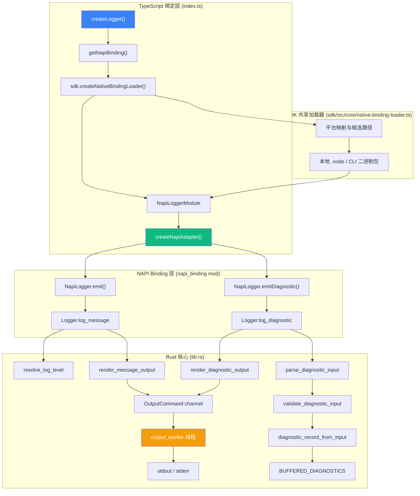

import { Callout, Cards, Tabs } from 'nextra/components'

# Logger 日志库

<Callout type="info">
**包信息**
- **npm 包名**: `@truenine/croessweave-sdk`
- **Rust crate**: `tnmsd`
- **Rust 源码位置**: `sdk/src/native_logger.rs`
- **TypeScript facade**: `sdk/src/libraries/logger.ts`
- **核心文件**: `sdk/src/native_logger.rs` (Rust 核心) · `sdk/src/libraries/logger.ts` (TypeScript facade)
</Callout>

Logger 是一个 **Rust 驱动的 AI 友好型 Markdown 日志库**，专为 croessweave 运行时设计。它将日志输出格式化为结构化 Markdown（`###` 标题 + 列表），使终端输出对人类可读的同时也能被 AI 工具高效解析。

## 核心特性

<Cards>
  <Cards.Card title="Markdown 结构化输出" href="/docs/sdk/logger#核心特性" icon="📝">
    所有日志以 `### Title` 格式输出，元数据使用 Markdown 列表渲染，天然适合 AI 解析和终端展示。
  </Cards.Card>
  <Cards.Card title="诊断错误格式" href="/docs/sdk/logger#核心特性" icon="🔍">
    `error` / `warn` / `fatal` 级别支持结构化诊断输入，包含 rootCause、exactFix、possibleFixes、details 四个语义区域。
  </Cards.Card>
  <Cards.Card title="诊断缓冲机制" href="/docs/sdk/logger#核心特性" icon="📦">
    即使在 Silent 模式下，诊断记录也会被缓冲到全局队列中，可通过 `drainBufferedDiagnostics()` 批量提取。
  </Cards.Card>
  <Cards.Card title="异步输出 Worker" href="/docs/sdk/logger#核心特性" icon="⚡">
    通过 `mpsc::channel` 驱动的独立输出线程，避免 I/O 阻塞主线程，支持显式 flush 同步。
  </Cards.Card>
  <Cards.Card title="N-API 跨平台绑定" href="/docs/sdk/logger#核心特性" icon="🔗">
    条件编译 `#[cfg(feature = "napi")]` 暴露 Node.js 绑定层，支持 win32/linux/darwin 五大平台。
  </Cards.Card>
</Cards>

## 架构总览



## API 参考

### 创建 Logger 实例

<Tabs items={['TypeScript', '说明']}>
  <Tabs.Tab>
```ts
import { createLogger } from '@truenine/croessweave-sdk'

const logger = createLogger('my-namespace')
const debugLogger = createLogger('my-namespace', 'debug')
```
  </Tabs.Tab>
  <Tabs.Tab>

| 参数 | 类型 | 必填 | 说明 |
| --- | --- | --- | --- |
| `namespace` | `string` | ✅ | 命名空间标识，用于区分不同模块的日志来源 |
| `logLevel?` | [`LogLevel`](#loglevel-类型) | ❌ | 初始日志级别，默认由全局级别或环境变量决定 |

返回值类型为 [`ILogger`](#ilogger-接口)。

  </Tabs.Tab>
</Tabs>

### LogLevel 类型

```ts
type LogLevel =
  | 'error'    // 优先级: 2 — 错误
  | 'warn'     // 优先级: 3 — 警告
  | 'info'     // 优先级: 4 — 信息（默认级别）
  | 'debug'    // 优先级: 5 — 调试
  | 'trace'    // 优先级: 6 — 追踪
  | 'fatal'    // 优先级: 1 — 致命错误
  | 'silent'   // 优先级: 0 — 静默（不输出但缓冲诊断）
```

**优先级规则**：数值越小越重要。只有当消息级别的 **优先级 ≤ 当前 logger 级别优先级** 时才会输出。

```
Silent(0) < Fatal(1) < Error(2) < Warn(3) < Info(4) < Debug(5) < Trace(6)
```

### ILogger 接口

ILogger 提供六个日志方法，分为两类：

| 方法 | 参数类型 | 输出目标 | 说明 |
| --- | --- | --- | --- |
| `info(message, ...meta)` | `string \| object, ...unknown[]` | stdout | 普通信息日志 |
| `debug(message, ...meta)` | `string \| object, ...unknown[]` | stdout | 调试日志 |
| `trace(message, ...meta)` | `string \| object, ...unknown[]` | stdout | 追踪日志 |
| `error(diagnostic)` | [`LoggerDiagnosticInput`](#loggerdiagnosticinput) | stderr | 结构化错误诊断 |
| `warn(diagnostic)` | [`LoggerDiagnosticInput`](#LoggerDiagnosticInput) | stderr | 结构化警告诊断 |
| `fatal(diagnostic)` | [`LoggerDiagnosticInput`](#LoggerDiagnosticInput) | stderr | 结构化致命错误诊断 |

> **注意**：`info` / `debug` / `trace` 接受普通消息字符串；`error` / `warn` / `fatal` 接受结构化的诊断对象。

### 全局函数

<Tabs items={['函数签名', '说明']}>
  <Tabs.Tab>
```ts
// 设置全局日志级别（影响所有后续创建的 logger）
setGlobalLogLevel(level: LogLevel): void

// 获取当前全局日志级别
getGlobalLogLevel(): LogLevel | undefined

// 清空已缓冲的诊断记录
clearBufferedDiagnostics(): void

// 提取并清空所有缓冲的诊断记录
drainBufferedDiagnostics(): LoggerDiagnosticRecord[]

// 强制刷新输出 worker 的缓冲区
flushOutput(): void
```
  </Tabs.Tab>
  <Tabs.Tab>
**setGlobalLogLevel**: 使用原子操作 (AtomicU8) 设置全局级别，立即生效

**getGlobalLogLevel**: 返回当前全局级别，未设置时返回 undefined

**clearBufferedDiagnostics**: 清空全局诊断缓冲区

**drainBufferedDiagnostics**: 以 JSON 数组形式返回所有缓冲记录并清空缓冲区

**flushOutput**: 通过 OutputCommand::Flush 与输出 worker 同步，等待 ack 确认完成
  </Tabs.Tab>
</Tabs>

### 类型定义

#### LoggerDiagnosticInput

诊断错误的输入结构，用于 `error()` / `warn()` / `fatal()` 方法：

```ts
interface LoggerDiagnosticInput {
  readonly code: string                       // 错误代码标识
  readonly title: string                      // 显示标题（用于 ### 渲染）
  readonly rootCause: DiagnosticLines         // 必填，问题描述（至少一行）
  readonly exactFix?: DiagnosticLines         // 可选，精确修复步骤
  readonly possibleFixes?: readonly DiagnosticLines[]  // 可选，备选修复方案列表
  readonly details?: Record<string, unknown>  // 可选，附加上下文数据
}

type DiagnosticLines = readonly [string, ...string[]]  // 至少包含一个元素的只读元组
```

#### LoggerDiagnosticRecord

经过验证和构建后的完整诊断记录：

```ts
interface LoggerDiagnosticRecord extends LoggerDiagnosticInput {
  readonly level: LoggerDiagnosticLevel     // 实际日志级别 ('error' | 'warn' | 'fatal')
  readonly namespace: string                // 来源命名空间
  readonly copyText: DiagnosticLines        // 可复制文本版本（纯 Markdown 行数组）
}
```

---

## Rust 核心实现说明

### 日志级别优先级系统

`LogLevel` 枚举定义了 7 个级别，通过 `priority()` 方法映射为数值：

| Level | Priority | 含义 |
| --- | --- | --- |
| `Silent` | 0 | 静默模式，不输出任何内容但仍缓冲诊断 |
| `Fatal` | 1 | 致命错误 |
| `Error` | 2 | 一般错误 |
| `Warn` | 3 | 警告 |
| `Info` | 4 | 信息（默认级别） |
| `Debug` | 5 | 调试信息 |
| `Trace` | 6 | 最详细的追踪信息 |

级别解析遵循以下优先链（见 `resolve_log_level()`）：

```
显式参数 > 全局级别 > LOG_LEVEL 环境变量 > Info(默认)
```

### 输出格式化机制

所有日志输出均被格式化为 **Markdown** 格式：

#### 普通消息 (`render_message_output()`)

```markdown
### 你的消息标题

- key: value          # meta 数据以列表形式展示
```

当消息包含换行时，首行作为标题，其余部分作为正文块：

```markdown
### 第一行标题

第二行内容
第三行内容
```

#### 诊断输出 (`render_diagnostic_output()`)

诊断记录被渲染为四个语义化区块：

```markdown
### 诊断标题

**What happened**
  - 这里描述发生了什么问题

**Do this**
  - 这是精确的修复步骤

**Try this if needed**
  1. 备选方案一的第一步
     备选方案一的延续

**Context**
  - path: /some/file.json
  - phase: cleanup
```

### 诊断记录验证和构建逻辑

诊断输入经过两阶段处理：

1. **反序列化** — 将 JSON `Value` 解析为 `LoggerDiagnosticInput`
2. **验证** — `validate_diagnostic_input()` 检查：
   - `code` 和 `title` 必须是非空字符串
   - `rootCause` 必须至少包含一行
   - `exactFix` 如果存在则不能为空
   - `possibleFixes` 如果存在则必须包含至少一个非空条目

验证失败时，自动生成一个 `LOGGER_DIAGNOSTIC_SCHEMA_INVALID` 记录，将原始 payload 和验证错误嵌入 `details` 字段（见 `invalid_diagnostic_record`）。

### NAPI Binding 层

NAPI 绑定通过条件编译 `#[cfg(feature = "napi")]` 启用（见 `napi_binding` mod），主要职责：

- **`NapiLogger`** 结构体包装内部 `Logger`，暴露两个方法：
  - `emit(level, message, meta?)` — 处理普通消息日志
  - `emit_diagnostic(level, diagnostic)` — 处理诊断日志
- **全局函数桥接**：`create_logger`、`set_global_log_level`、`get_global_log_level`、`clear_buffered_diagnostics`、`drain_buffered_diagnostics`、`flush_output`
- **参数归一化**：`normalize_message_payload()` 和 `normalize_json_value()` 确保 JS 传入的数据能正确映射到 Rust 的 `Value` 类型

### 异步 Output Worker 机制

输出不直接写入 stdout/stderr，而是通过 `mpsc::channel` 发送到独立的 **output_worker 线程**（见 `spawn_output_sink()`）：

```rust
enum OutputCommand {
  Write { use_stderr: bool, output: String },  // 写入命令
  Flush { ack: Sender<()> },                     // 刷新同步命令
}
```

- **Write 命令**：根据 `use_stderr` 选择 stdout 或 stderr，使用 `BufWriter` 缓冲写入
- **Flush 命令**：刷新两个 writer 并通过 `ack` channel 通知调用方完成
- 当 channel 发送失败时（如 worker 已退出），回退到直接写入（`print_output_direct()`）

**stderr 分发规则**（见 `writes_to_stderr()`）：`Error`、`Fatal`、`Warn` 三个级别写入 stderr；其余级别写入 stdout。

---

## TypeScript 绑定层说明

### 共享 Native Binding 加载

Logger 的 TypeScript facade 已迁到 `sdk/src/libraries/logger.ts`，该文件现在是一个薄 re-export wrapper。SDK 内联实现不再复制平台检测、本地候选路径和 CLI 平台包扫描逻辑，只保留三件 Logger 特有的事情：

- `isNapiLoggerModule()`：校验 native export 的形状
- `createNativeBindingLoader(...)`：声明 `packageName`、`binaryName` 和 `cliExportName`
- `createNapiAdapter()`：把 `NapiLoggerInstance` 适配为公共 `ILogger`

真正的平台后缀映射、本地 `.node` 候选路径、CLI 平台包探测、缓存与聚合错误格式化，已经统一收敛到 `sdk/src/core/native-binding-loader.ts`。

统一后的好处是，新增平台、调整候选路径或修复包内扫描逻辑时，只需要改 `sdk/` 里的一个实现，Logger 自己不再维护一份平行副本。

### 适配器工厂模式

`createNapiAdapter()` 将底层 `NapiLoggerInstance` 转换为公共 `ILogger` 接口：

- **普通日志方法**（info/debug/trace）：通过 `createLogMethod` 工厂创建，将可变参数打包后传给 `instance.emit()`
- **诊断日志方法**（error/warn/fatal）：通过 `createDiagnosticMethod` 工厂创建，直接传给 `instance.emitDiagnostic()`

---

## 使用示例

### 示例 1：基本日志记录

演示 info、debug、trace 三种普通日志的使用方式：

```ts
import { createLogger } from '@truenine/croessweave-sdk'

const logger = createLogger('example-app')

// info — 默认可见
logger.info('应用启动成功')
// 输出: ### 应用启动成功

// info — 带 meta 对象
logger.info('处理请求', { method: 'GET', path: '/api/users', duration: 42 })
// 输出:
// ### 处理请求
//
//   - method: GET
//   - path: /api/users
//   - duration: 42

// debug — 需要日志级别 >= debug 才可见
logger.debug('查询数据库', { table: 'users', query: 'SELECT * FROM users' })

// trace — 最详细级别
logger.trace('进入函数', { fn: 'processRequest', args: ['req', 'res'] })
```

### 示例 2：诊断错误输出

演示 error、warn、fatal 三种结构化诊断日志：

```ts
import { createLogger } from '@truenine/croessweave-sdk'

const logger = createLogger('config-loader')

// error — 完整诊断（含所有字段）
logger.error({
  code: 'CONFIG_FILE_NOT_FOUND',
  title: '配置文件不存在',
  rootCause: [
    '指定的配置文件路径下没有找到有效的配置文件',
    '程序需要 config.json 来初始化运行时环境'
  ],
  exactFix: [
    '在项目根目录创建 config.json 文件',
    '或使用 --config-path 指定正确的配置文件位置'
  ],
  possibleFixes: [
    ['从版本控制恢复已删除的 config.json'],
    ['运行 init 命令重新生成默认配置']
  ],
  details: {
    searchedPaths: ['./config.json', '/etc/app/config.json'],
    expectedFormat: 'JSON'
  }
})
// 输出:
// ### 配置文件不存在
//
// **What happened**
//   - 指定的配置文件路径下没有找到有效的配置文件
//   - 程序需要 config.json 来初始化运行时环境
//
// **Do this**
//   - 在项目根目录创建 config.json 文件
//   - 或使用 --config-path 指定正确的配置文件位置
//
// **Try this if needed**
//   1. 从版本控制恢复已删除的 config.json
//      运行 init 命令重新生成默认配置
//
// **Context**
//   - searchedPaths:
//     - ./config.json
//     - /etc/app/config.json
//   - expectedFormat: JSON

// warn — 简洁警告
logger.warn({
  code: 'DEPRECATED_OPTION',
  title: '使用了已弃用的选项',
  rootCause: ['--legacy-flag 将在下个主版本中被移除'],
  exactFix: ['改用 --new-flag 替代']
})

// fatal — 致命错误
logger.fatal({
  code: 'RUNTIME_PANIC',
  title: '运行时发生不可恢复错误',
  rootCause: ['内存分配失败，无法继续执行'],
  exactFix: ['检查系统可用内存并重启应用'],
  details: { allocatedMB: 2048, limitMB: 2048 }
})
```

### 示例 3：全局级别控制和诊断缓冲

演示如何利用全局级别控制和诊断缓冲机制进行集中式日志管理：

```ts
import {
  createLogger,
  setGlobalLogLevel,
  getGlobalLogLevel,
  clearBufferedDiagnostics,
  drainBufferedDiagnostics,
  flushOutput
} from '@truenine/croessweave-sdk'

// 1. 设置全局级别为 warn — 只显示 error/warn/fatal
setGlobalLogLevel('warn')
console.log(getGlobalLogLevel())  // 'warn'

const logger = createLogger('batch-processor')

// 这些不会输出到终端（级别低于 warn）
logger.info('开始批处理')        // 被过滤
logger.debug('读取第 1 条记录')   // 被过滤
logger.trace('解析 JSON payload') // 被过滤

// 但诊断会被缓冲！
logger.error({
  code: 'PARSE_ERROR',
  title: 'JSON 解析失败',
  rootCause: ['第 42 行存在语法错误'],
  exactFix: ['修正 JSON 格式后重试']
})

logger.warn({
  code: 'SLOW_QUERY',
  title: '查询耗时过长',
  rootCause: ['查询执行时间超过 5000ms'],
  possibleFixes: [['添加索引优化查询性能']]
})

// 2. 提取所有缓冲的诊断记录（包括 silent 模式下的）
const diagnostics = drainBufferedDiagnostics()
console.log(`捕获了 ${diagnostics.length} 条诊断记录`)
// 输出: 捕获了 2 条诊断记录

diagnostics.forEach(d => {
  console.log(`[${d.level}] ${d.code}: ${d.title}`)
  console.log(`  命名空间: ${d.namespace}`)
  console.log(`  可复制文本:\n${d.copyText.join('\n')}`)
})

// 3. 刷新确保所有输出已写入
flushOutput()

// 4. 清空缓冲区
clearBufferedDiagnostics()
console.log(drainBufferedDiagnostics().length)  // 0
```

---

## 配置选项

### LOG_LEVEL 环境变量

可以通过 `LOG_LEVEL` 环境变量设置默认日志级别（在不传显式参数且未设置全局级别时生效）：

```bash
# bash / zsh
export LOG_LEVEL=debug
LOG_LEVEL=trace tnmsc run

# Windows PowerShell
$env:LOG_LEVEL = "warn"
```

环境变量的解析使用 `from_str_loose()` 函数，支持大小写不敏感匹配。

### 命名空间 (Namespace)

命名空间是每个 Logger 实例的身份标识，作用包括：

- 在诊断记录的 `namespace` 字段中标明来源
- 在缓冲诊断时用于分类和筛选
- 便于在大型项目中定位日志来源

```ts
// 推荐：按功能模块划分命名空间
const dbLogger = createLogger('database')
const httpLogger = createLogger('http-server')
const pluginLogger = createLogger('plugin-system')
```

<Callout type="warning">
**命名空间最佳实践**
- 使用小写字母和连字符（如 `plugin-pipeline`）
- 保持粒度一致——同一模块内共享同一命名空间
- 避免过于笼统的名称（如 `app` 或 `logger`）
</Callout>

---

## Rust 宏速览

Rust 侧提供了四个便捷宏：

| 宏 | 用途 | 示例 |
| --- | --- | --- |
| `log_info!` | 快速输出 info 日志 | `log_info!(logger, "启动完成")` |
| `log_info!` | 带 meta 的 info | `log_info!(logger, "处理", json!({"count": 10}))` |
| `log_error!` | 输出错误诊断 | `log_error!(logger, diagnostic_input)` |
| `log_warn!` | 输出警告诊断 | `log_warn!(logger, diagnostic_input)` |
| `log_debug!` | 快速输出 debug 日志 | `log_debug!(logger, "变量值", json!({"x": 42}))` |
