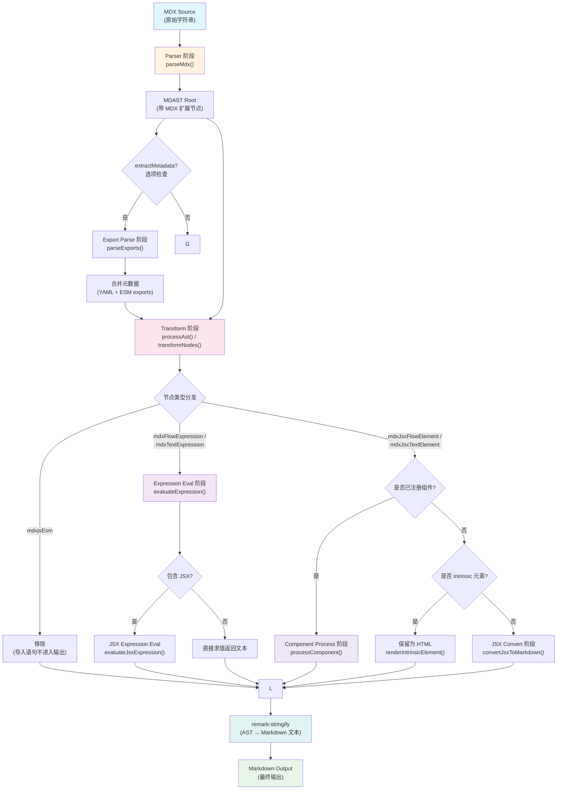
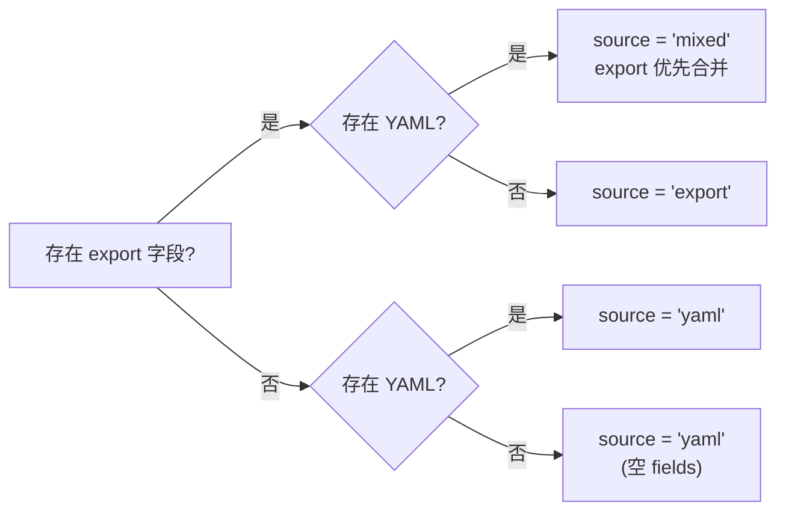
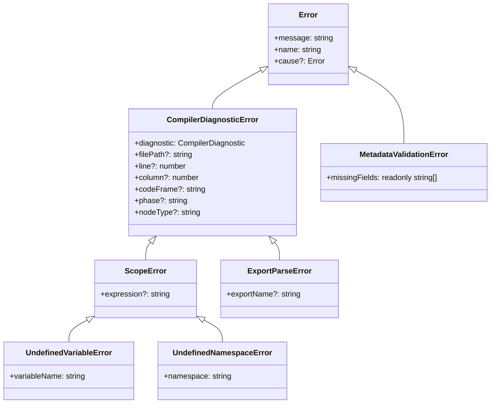

import { Callout, Cards, Steps, Tabs } from 'nextra/components'

# MDX-Compiler 编译器

<Callout type="info">
  **包标识**: `@truenine/memory-sync-sdk` (npm) / `tnmsd` (Rust crate)  
  **源码位置**: `sdk/src/md-compiler/`
  **导出入口**: `src/index.ts`
</Callout>

## 概述

MDX-Compiler 是 memory-sync monorepo 中的 **Rust-first MDX/Markdown 编译与转换引擎**。它负责将 MDX 源码编译为纯 Markdown 文本，同时提供表达式求值、JSX 组件处理、导出元数据提取以及 TOML artifact 构建等核心能力。

### 核心能力

| 能力 | 说明 |
| --- | --- |
| **MDX → Markdown 转换** | 将包含 JSX、表达式插值、ESM 导出的 MDX 文件编译为标准 Markdown |
| **表达式求值** | 在受控作用域内安全求值 JavaScript 表达式（`{expression}`） |
| **JSX 组件处理** | 通过 `ComponentRegistry` 机制注册和处理内置/自定义组件 |
| **导出元数据解析** | 从 `export const` / `export default` 语句中静态提取 frontmatter 字段 |
| **TOML Artifact 构建** | 为 Prompt 工程场景构建结构化的 TOML 文档 |

### 设计哲学：Rust-first with Shared Loader

MDX-Compiler 当前采用 **Native-first 入口 + TypeScript 参考实现** 的结构：

1. **Native Binding 层（Rust/NAPI）**：核心编译逻辑由 Rust crate `tnmsd` 实现，通过 NAPI-RS 暴露给 Node.js。公开包入口默认走这条路径。
2. **TypeScript 参考实现（`src/compiler/`）**：仓库内保留完整的 TypeScript 编译流水线，用于源级测试、实现对照和调试，但公共包入口不会自动切换到它。

运行时入口通过 `native-binding.ts` 中的 `getNapiMdCompilerBinding()` 接入 `sdk/src/core/native-binding-loader.ts`：

- 优先加载平台匹配的 `.node` 二进制文件
- 支持从 CLI binary package (`@truenine/memory-sync-cli-<suffix>`) 中提取 binding
- `TNMSC_DISABLE_NATIVE_BINDING=1` 会让公共入口快速失败，用于验证缺失 native binding 的错误路径

<Tabs items={["支持的目标平台", "加载控制"]}>
  <Tabs.Tab>
    ```text
    win32-x64   → napi-md-compiler.win32-x64-msvc
    linux-x64   → napi-md-compiler.linux-x64-gnu
    linux-arm64 → napi-md-compiler.linux-arm64-gnu
    darwin-arm64→ napi-md-compiler.darwin-arm64
    darwin-x64  → napi-md-compiler.darwin-x64
    ```
  </Tabs.Tab>
  <Tabs.Tab>
    ```bash
    # 强制尝试 native binding
    TNMSC_FORCE_NATIVE_BINDING=1

    # 禁用 native binding 并验证错误路径
    TNMSC_DISABLE_NATIVE_BINDING=1
    ```
  </Tabs.Tab>
</Tabs>

## 核心 API

### `mdxToMd` — 主编译函数

`mdxToMd()` 是库的主入口函数，将 MDX 源码字符串编译为 Markdown。

```typescript
// 签名 1：基本用法，返回纯字符串
function mdxToMd(
  content: string,
  options?: MdxToMdOptions & { extractMetadata?: false }
): Promise<string>

// 签名 2：带元数据提取，返回结构化结果
function mdxToMd(
  content: string,
  options: MdxToMdOptions & { extractMetadata: true }
): Promise<MdxToMdResult>
```

#### MdxToMdOptions 参数说明

| 参数 | 类型 | 默认值 | 说明 |
| --- | --- | --- | --- |
| `scope` | `EvaluationScope` | `{}` | 自定义求值作用域变量，会与 globalScope 合并（自定义优先） |
| `basePath` | `string \| undefined` | — | 文件解析的基础路径 |
| `filePath` | `string \| undefined` | — | 源文件完整路径，用于错误诊断信息 |
| `globalScope` | `MdxGlobalScope \| undefined` | — | 全局作用域（含 `os`、`env`、`profile`、`codeStyles`、`tool`） |
| `extractMetadata` | `boolean` | `false` | 是否提取并返回导出元数据 |

#### MdxToMdResult 返回类型

```typescript
interface MdxToMdResult {
  /** 编译后的 Markdown 内容 */
  content: string
  /** 从 export 语句和 YAML frontmatter 中提取的元数据 */
  metadata: ExportMetadata
}

interface ExportMetadata {
  /** 提取的字段键值对 */
  fields: Record<string, unknown>
  /** 元数据来源类型 */
  source: 'export' | 'yaml' | 'mixed'
}
```

### `buildPromptTomlArtifact` — Prompt TOML 构建

`buildPromptTomlArtifact()` 用于构建面向 Prompt 工程场景的结构化 TOML 文档。

```typescript
function buildPromptTomlArtifact(
  options: BuildPromptTomlArtifactOptions
): string
```

#### BuildPromptTomlArtifactOptions 参数说明

| 参数 | 类型 | 必填 | 说明 |
| --- | --- | --- | --- |
| `content` | `string` | ✅ | MDX 编译后的正文内容 |
| `bodyFieldName` | `string` | ✅ | 正文字段在 TOML 中的字段名 |
| `frontMatter` | `Readonly<Record<string, unknown>>` | ❌ | 额外的 frontmatter 键值对 |
| `fieldNameMap` | `Readonly<Record<string, string>>` | ❌ | 字段名映射表（原字段名 → TOML 字段名） |
| `excludedKeys` | `readonly string[]` | ❌ | 需要排除的字段名列表 |
| `extraFields` | `Readonly<Record<string, unknown>>` | ❌ | 额外注入的自定义字段 |
| `fieldOrder` | `readonly string[]` | ❌ | TOML 字段输出顺序 |

### `buildTomlDocument` — 通用 TOML 文档构建

```typescript
function buildTomlDocument(
  value: Readonly<Record<string, unknown>>,
  options?: BuildTomlDocumentOptions
): string

interface BuildTomlDocumentOptions {
  readonly fieldOrder?: readonly string[]
}
```

### 编译器内部 API（低级接口）

以下 API 通过 `src/compiler/index.ts` 导出，适用于需要精细控制编译流程的场景：

| API | 来源文件 | 说明 |
| --- | --- | --- |
| `parseMdx(source)` | `parser.ts` | 将 MDX 字符串解析为 MDAST（unified + remark 插件链） |
| `evaluateExpression(expr, scope, opts?)` | `expression-eval.ts` | 在给定作用域中求值 JS 表达式 |
| `evaluateJsxExpression(node, ctx, processAstFn)` | `jsx-expression-eval.ts` | 求值可能包含 JSX 元素的表达式 |
| `processComponent(element, ctx, processAstFn)` | `component-processor.ts` | 处理已注册的内置组件 |
| `registerComponent(name, handler)` | `component-registry.ts` | 注册自定义组件处理器 |
| `hasComponent(name)` / `getComponents()` / `clearComponents()` | `component-registry.ts` | 组件注册表的查询与管理 |
| `parseExports(esmNodes, options?)` | `export-parser.ts` | 从 ESM 节点中解析导出元数据 |
| `isStaticallyEvaluable(valueStr)` | `export-parser.ts` | 检查值是否可静态求值 |
| `processAst(ast, ctx)` | `transformer.ts` | 执行完整的 AST 转换流水线 |

## 编译器流水线

MDX-Compiler 采用多阶段流水线架构，每个阶段职责清晰、可独立测试。以下是完整的编译流程：



### 阶段详解

#### 1. Parser 阶段 — MDX AST 构建

`parser.ts` 使用 **unified** 处理器链构建 MDAST：

```typescript
// 解析器插件链
const processor = unified()
  .use(remarkParse)        // 标准 Markdown 解析
  .use(remarkGfm)          // GFM 扩展（表格、任务列表、删除线）
  .use(remarkFrontmatter, ['yaml'])  // YAML frontmatter 支持
  .use(remarkMdx)          // MDX 扩展（JSX、表达式、ESM）
```

生成的 AST 节点类型包括：
- 标准 MDAST 节点：`heading`, `paragraph`, `code`, `list`, `link` 等
- GFM 扩展节点：`table`, `taskList`, `strikethrough`
- MDX 扩展节点：`mdxJsxFlowElement`, `mdxJsxTextElement`, `mdxFlowExpression`, `mdxTextExpression`, `mdxjsEsm`
- Frontmatter 节点：`yaml`

#### 2. Expression Eval 阶段 — 表达式求值

`expression-eval.ts` 负责在受控作用域内求值 JavaScript 表达式。

**求值策略分两层**：

1. **简单引用路径**（`identifier` 或 `a.b.c` 形式）：直接在 scope 对象上做属性查找，提供精确的错误信息
2. **复杂表达式**（含运算符、函数调用等）：使用 `new Function()` 构造器在隔离环境中执行

```typescript
// 简单引用：直接属性查找
const SIMPLE_REFERENCE_PATTERN = /^[a-z_$][\w$]*(?:\.[a-z_$][\w$]*)*$/iu

// 复杂表达式：Function 构造器
const fn = new Function(...scopeKeys, `return (${expression})`)
const result = fn(...scopeValues)
```

支持的 MDX 表达式节点类型：

| 节点类型 | 出现位置 | 示例 |
| --- | --- | --- |
| `MdxFlowExpression` | 块级表达式 `{...}` | `{title}` 在段落级别 |
| `MdxTextExpression` | 行内表达式 `{...}` | `Hello {name}!` 在文本中 |
| `MdxJsxAttributeValueExpression` | JSX 属性表达式 | `<Md when={isVisible}>` |

对于表达式中嵌入 JSX 的情况（如 `{condition && <Md>content</Md>}`），流转至 `jsx-expression-eval.ts` 处理，它基于 estree AST 递归求值，支持逻辑运算符 (`&&`, `||`, `??`)、条件表达式 (`?:`)、序列表达式 (`,`) 和数组展开。

#### 3. Component Process 阶段 — JSX 组件处理

`component-processor.ts` 和 `component-registry.ts` 共同实现组件处理机制。

**ComponentHandler 类型签名**：

```typescript
type ComponentHandler = (
  element: MdxJsxFlowElement | MdxJsxTextElement,
  ctx: ProcessingContext,
  processChildren: (children: RootContent[], ctx: ProcessingContext) => Promise<RootContent[]>
) => Promise<RootContent[]>
```

每个组件处理器接收三个参数：
- `element`: 原始 JSX 元素节点
- `ctx`: 处理上下文（含作用域、组件映射、调用栈）
- `processChildren`: 递归处理子节点的函数

**内置组件**：当前注册的唯一内置组件是 `Md`，它是一个条件渲染包装器：

```tsx
<Md when={someCondition}>
  仅当条件为真时渲染的内容
</Md>

<Md.Line when={isVisible}>
  行内条件文本
</Md.Line>
```

`Md` 组件的 `when` 属性支持：
- 字面量布尔值：`when="true"` / `when="false"`
- 表达式求值：`when={profile.role === 'admin'}`

**循环依赖检测**：`ProcessingContext.processingStack` 维护组件调用栈，检测到循环引用时抛出明确错误。

#### 4. Export Parse 阶段 — 元数据提取

`export-parser.ts` 从 MDX 的 ESM (`mdxjsEsm`) 节点中静态分析并提取元数据。

**支持的导出模式**：

```mdx
// 模式 1: 单个命名导出
export const title = "My Document"

// 模式 2: 对象展开导出（metadata 特殊键）
export const metadata = { name: "test", enabled: true }

// 模式 3: default 导出（对象会被展开）
export default { title: "Default Title", version: 2 }
```

**静态求值支持的字面量类型**：

| 类型 | 示例 | 说明 |
| --- | --- | --- |
| 字符串 | `"hello"`, `'world'`, `` `template` `` | 支持转义序列 |
| 数字 | `42`, `3.14`, `-10` | 含负数和小数 |
| 布尔值 | `true`, `false` | — |
| 空值 | `null` | — |
| 数组 | `[1, "two", true]` | 支持嵌套和变量引用 |
| 对象 | `{ key: "value" }` | 支持嵌套和变量引用 |
| 变量引用 | `tool.readFile`, `profile.name` | 从 scope 中解析 |

**元数据来源判定规则**：



#### 5. JSX Convert 阶段 — JSX → Markdown 转换

`jsx-converter.ts` 将未被组件注册表捕获的标准 HTML/JSX 元素转换为等效的 Markdown AST 节点。

**支持的元素转换映射**：

| JSX 元素 | 目标 Markdown 节点 | 说明 |
| --- | --- | --- |
| `<pre><code>` | `Code` (fenced code block) | 从 `className` 提取语言标识 |
| `<a>` | `Link` | 映射 `href` / `title` 属性 |
| `<strong>` / `<b>` | `Strong` | 加粗文本 |
| `<em>` / `<i>` | `Emphasis` | 斜体文本 |
| `` | `Image` | 映射 `src` / `alt` / `title` |
| `<blockquote>` | `Blockquote` | 引用块 |

**Intrinsic 元素保留机制**：对于以小写字母开头或包含连字符的元素名（如 `<div>`, `<span>`, `<custom-element>`），转换器不会尝试转换为 Markdown，而是保留为原始 HTML 标签输出。属性中的表达式也会被求值后序列化。

#### 6. Transform 阶段 — 最终输出生成

`transformer.ts` 是流水线的编排层，递归遍历 AST 并按节点类型分发到上述各阶段处理器。

关键行为：
- **源码感知渲染 (Source-Aware Rendering)**：当 AST 节点包含有效的 position 信息且拥有 `sourceText` 时，采用源码切片 + 子节点替换的策略，最大程度保留原始格式
- **链接文本简化**：形如 `path/to/file.ext` 的链接文本自动简化为 `file.ext`
- **注释表达式过滤**：`{/* comment */}` 形式的表达式被静默移除
- **Markdown 序列化**：使用 `remark-stringify` 将处理后的 AST 转换为 Markdown 字符串，配置为 GFM 兼容输出

## 依赖关系

### 内部依赖

<Callout type="info">
  MDX-Compiler 通过 workspace 依赖使用 `tnmsd` 库进行编译过程中的日志输出。
</Callout>

### 外部依赖 (devDependencies)

| 包名 | 用途 | 使用位置 |
| --- | --- | --- |
| `unified` | 统一文本处理框架 | Parser、Transformer 的处理器基础 |
| `remark-parse` | Markdown → MDAST 解析器 | Parser 阶段 |
| `remark-gfm` | GitHub Flavored Markdown 支持 | Parser、Stringify 阶段 |
| `remark-frontmatter` | YAML frontmatter 解析 | Parser 阶段 |
| `remark-mdx` | MDX 语法扩展（JSX/表达式/ESM） | Parser 阶段 |
| `remark-stringify` | MDAST → Markdown 序列化 | Transform 输出阶段 |
| `mdast-util-mdx` | MDX 节点类型定义 | 类型系统全层 |
| `yaml` | YAML 解析与序列化 | Frontmatter 处理、Export Parser |
| `@types/estree` / `@types/estree-jsx` | ESTree AST 类型定义 | JSX Expression Eval |
| `@types/mdast` | MDAST 类型定义 | 类型系统 |

### Rust 依赖 (Cargo.toml)

| Crate | 用途 |
| --- | --- |
| `tnmsd` | Workspace 日志库 |
| `serde` / `serde_json` | JSON 序列化（NAPI 参数传递） |
| `serde_yml` | YAML 解析（frontmatter 处理） |
| `markdown` | markdown-rs 解析器（Rust 端 MDX 解析） |
| `json5` | JSON5 格式支持 |
| `napi` / `napi-derive` | NAPI-RS 绑定层（feature-gated） |
| `regex-lite` | 轻量正则（frontmatter 提取等） |

## 全局作用域 (Global Scope)

MDX 表达式可以访问预定义的全局作用域对象，类型定义位于 `globals/index.ts`：

```typescript
interface MdxGlobalScope {
  profile: UserProfile       // 用户档案信息
  codeStyles: CodeStylePreferences  // 代码风格偏好
  tool: ToolReferences       // AI 工具名称引用
  env: EnvironmentContext     // 环境变量上下文
  os: OsInfo                 // 操作系统信息
  Md: MdComponent            // 条件渲染组件
}
```

### ToolPresets 预设

库提供了三组工具名称预设，适配不同的 AI 工具环境：

```typescript
import { ToolPresets } from '@truenine/memory-sync-sdk/globals'

// 默认预设 (snake_case)
ToolPresets.default
// → { websearch: 'web_search', readFile: 'read_file', ... }

// Claude Code CLI 预设 (PascalCase)
ToolPresets.claudeCode
// → { readFile: 'Read', writeFile: 'Write', executeCommand: 'Execute', ... }

// Kiro 预设 (camelCase)
ToolPresets.kiro
// → { readFile: 'readFile', websearch: 'remote_web_search', ... }
```

## 使用示例

### 示例 1：基本 MDX 转 Markdown

最简单的用法——传入 MDX 字符串，获取编译后的 Markdown：

```typescript
import { mdxToMd } from '@truenine/memory-sync-sdk'

const mdxSource = `
# Hello MDX

Welcome to **MDX-Compiler**!

This is a {typeof mdx === 'undefined' ? 'compiled' : 'raw'} document.

- Item 1
- Item 2
- Item 3
`.trim()

const markdown = await mdxToMd(mdxSource)

console.log(markdown)
// 输出:
// # Hello MDX
//
// Welcome to **MDX-Compiler**!
//
// This is a compiled document.
//
// - Item 1
// - Item 2
// - Item 3
```

### 示例 2：带自定义选项的编译

使用自定义作用域、全局作用域和文件路径进行编译：

```typescript
import { mdxToMd, MdxToMdOptions } from '@truenine/memory-sync-sdk'

const mdxSource = `
# Profile Page

Hello, {profile.name}!

Your OS is {os.platform} ({os.arch}).

Environment: {env.NODE_ENV ?? 'development'}

<Md when={profile.role === 'admin'}>
  > Admin-only content visible here.
</Md>

Tools available: {tool.readFile}, {tool.writeFile}
`.trim()

const options: MdxToMdOptions = {
  filePath: '/templates/profile.mdx',
  basePath: '/templates',
  globalScope: {
    profile: { name: 'Alice', role: 'admin', username: 'alice' },
    codeStyles: { indent: 'space', tabSize: 2 },
    tool: { readFile: 'read_file', writeFile: 'write_file' },
    env: { NODE_ENV: 'production' },
    os: { platform: 'linux', arch: 'x64', kind: 'linux' as const }
  },
  scope: {
    customVar: 'custom value'
  }
}

const result = await mdxToMd(mdxSource, { ...options, extractMetadata: true })

console.log(result.content)
console.log(result.metadata)
// metadata:
// {
//   fields: {},
//   source: 'yaml'
// }
```

### 示例 3：TOML Artifact 构建 (Prompt 工程场景)

构建用于 AI Prompt 的结构化 TOML 文档：

```typescript
import { mdxToMd, buildPromptTomlArtifact } from '@truenine/memory-sync-sdk'

const promptContent = `
# System Prompt

You are a helpful assistant.

## Instructions

- Be concise
- Use Markdown formatting
`.trim()

const tomlOutput = buildPromptTomlArtifact({
  content: promptContent,
  bodyFieldName: 'prompt_content',
  frontMatter: {
    role: 'system',
    model: 'claude-sonnet-4-20250514',
    temperature: 0.7,
    max_tokens: 4096
  },
  fieldNameMap: {
    role: 'role',
    temperature: 'temperature',
    max_tokens: 'max_tokens'
  },
  excludedKeys: ['internal_note'],
  extraFields: {
    version: '1.0.0',
    generated_at: new Date().toISOString()
  },
  fieldOrder: ['role', 'model', 'temperature', 'max_tokens', 'prompt_content', 'version', 'generated_at']
})

console.log(tomlOutput)
// 输出类似:
// role = "system"
// model = "claude-sonnet-4-20250514"
// temperature = 0.7
// max_tokens = 4096
// version = "1.0.0"
// generated_at = "2026-04-12T..."
//
// prompt_content = """
// # System Prompt
//
// You are a helpful assistant.
//
// ## Instructions
//
// - Be concise
// - Use Markdown formatting
// """
```

### 示例 4：导出元数据解析

从 MDX 的 `export` 语句中提取结构化元数据：

```typescript
import { mdxToMd } from '@truenine/memory-sync-sdk'

const mdxWithExports = `
---
author: yaml-author
tags: [from-yaml]
---

export const title = "My Document"
export const version = 2
export const enabled = true
export const tags = ["mdx", "compiler"]
export const metadata = { category: "docs", priority: "high" }
export default { description: "A sample document" }

# {title}

Version: {version}, Enabled: {enabled}
`.trim()

const result = await mdxToMd(mdxWithExports, {
  filePath: '/docs/sample.mdx',
  extractMetadata: true,
  scope: {}
})

console.log(JSON.stringify(result.metadata, null, 2))
// 输出:
// {
//   "fields": {
//     "author": "yaml-author",
//     "tags": ["mdx", "compiler"],
//     "title": "My Document",
//     "version": 2,
//     "enabled": true,
//     "category": "docs",
//     "priority": "high",
//     "description": "A sample document"
//   },
//   "source": "mixed"
// }
//
// 注意:
// - "tags" 被 export 覆盖了 YAML 中的值 (export 优先)
// - metadata 对象的属性被展开到顶层
// - export default 的对象也被展开
// - author 仅来自 YAML (无同名 export)
```

### 示例 5：自定义组件注册

注册自定义组件处理器来扩展编译能力：

```typescript
import {
  mdxToMd,
  registerComponent,
  clearComponents,
  type ComponentHandler,
  type MdxJsxFlowElement,
  type ProcessingContext,
  type RootContent
} from '@truenine/memory-sync-sdk'

// 定义一个 <Alert> 组件
const alertHandler: ComponentHandler = async (
  element: MdxJsxFlowElement,
  ctx: ProcessingContext,
  processChildren
) => {
  const typeAttr = element.attributes.find(
    a => a.type === 'mdxJsxAttribute' && a.name === 'type'
  )
  const alertType = typeof typeAttr?.value === 'string' ? typeAttr.value : 'info'

  const children = await processChildren(element.children as RootContent[], ctx)

  const prefixMap: Record<string, string> = {
    warning: '> ⚠️ ',
    error: '> ❌ ',
    info: '> ℹ️ ',
    success: '> ✅ '
  }

  const prefix = prefixMap[alertType] || '> '

  return [{
    type: 'blockquote',
    children: [
      { type: 'paragraph', children: [{ type: 'text', value: prefix }] },
      ...children.map(child =>
        child.type === 'paragraph' ? child : { type: 'paragraph', children: [child] }
      )
    ]
  }]
}

// 注册组件
registerComponent('Alert', alertHandler)

const mdx = `
# Custom Components

<Alert type="warning">
  This is a warning message with **bold** text inside.
</Alert>

<Alert type="success">
  Operation completed successfully!
</Alert>
`.trim()

const result = await mdxToMd(mdx)
console.log(result)

// 清理（通常在测试中使用）
clearComponents()
```

## 高级主题

### Native Binding 加载与 TypeScript 参考实现

<Steps>
  ### 运行时决策流程

  当调用公开入口 `mdxToMd()` 时，实际执行路径如下：

  1. **入口函数** (`src/mdx-to-md.ts`) 调用 `getNapiMdCompilerBinding().compileMdxToMd()`
  2. **Binding 入口** (`src/native-binding.ts`) 先处理环境变量开关，再委托 `sdk/src/core/native-binding-loader.ts`
  3. **共享加载器** 依次探测本地 `.node` 二进制文件与 CLI 平台包中的 binding
  4. **Rust 实现** (`lib.rs`) 通过 NAPI 暴露 `compile_mdx_to_md` 等函数
  5. **`src/compiler/`** 保留 TypeScript 参考流水线，用于源级测试和实现对照，而不是公开入口的自动 fallback

  ### 何时使用哪条路径？

  | 场景 | 主要路径 | 原因 |
  | --- | --- | --- |
  | SDK / CLI / MCP 公开入口 | Native (Rust) | 与发布产物一致，性能最佳 |
  | 调试编译流水线细节 | `src/compiler/*` | 直接查看 parser / evaluator / serializer 行为 |
  | 编写源级单元测试 | `src/compiler/*` | 不依赖 `.node` 制品打包 |
  | GUI Tauri 应用 | 直接调用 crate | 无需 NAPI 开销 |

  ### 加载控制

  ```bash
  # 禁用公开入口的 native binding，用于验证错误路径
  TNMSC_DISABLE_NATIVE_BINDING=1

  # 强制尝试 native binding
  TNMSC_FORCE_NATIVE_BINDING=1
  ```
</Steps>

### 性能优化建议

<Cards>
  <Cards.Card title="批量编译" href="/docs/sdk/md-compiler#性能优化建议" icon="⚡">
    对于大量文件的批量编译场景，复用 `ProcessingContext` 中的组件注册表和作用域对象，避免重复初始化。
  </Cards.Card>
  <Cards.Card title="作用域精简" href="/docs/sdk/md-compiler#性能优化建议" icon="🎯">
    只传递必要的 `scope` 字段。过大的作用域对象会增加序列化开销（Native 路径下需 JSON 序列化传递给 Rust）。
  </Cards.Card>
  <Cards.Card title="选择性元数据提取" href="/docs/sdk/md-compiler#性能优化建议" icon="📋">
    仅在需要时设置 `extractMetadata: true`。元数据提取涉及额外的 YAML 解析和 ESM 静态分析步骤。
  </Cards.Card>
  <Cards.Card title="避免深层嵌套组件" href="/docs/sdk/md-compiler#性能优化建议" icon="🔄">
    组件的递归深度受 `processingStack` 保护，但深层嵌套仍会增加处理时间。建议组件嵌套不超过 3 层。
  </Cards.Card>
</Cards>

### 错误处理最佳实践

MDX-Compiler 提供了结构化的错误体系，定义于 `errors/index.ts`：

#### 错误类型层级



#### 关键错误类说明

| 错误类 | 触发场景 | diagnostic.phase | 诊断信息 |
| --- | --- | --- | --- |
| `UndefinedVariableError` | 表达式引用了未定义的变量 | `expression-evaluation` | 变量名、表达式原文、代码帧 |
| `UndefinedNamespaceError` | 表达式引用了未定义的命名空间（根变量） | `expression-evaluation` | 命名空间名、表达式原文 |
| `ExportParseError` | export 语句无法静态求值 | `export-parsing` | 导出名、原因提示 |
| `MetadataValidationError` | 缺少必需的元数据字段 | — | 缺失字段列表 |

#### CompilerDiagnostic 结构

所有编译期错误都附带 `CompilerDiagnostic` 对象，包含丰富的定位信息：

```typescript
interface CompilerDiagnostic {
  filePath?: string          // 源文件路径
  line?: number              // 起始行号
  column?: number            // 起始列号
  endLine?: number           // 结束行号
  endColumn?: number         // 结束列号
  snippet?: string           // 错误位置代码片段
  sourceLine?: string        // 所在行的完整源码
  codeFrame?: string         // 带指针的代码帧
  expression?: string        // 导致错误的表达式
  exportName?: string        // 相关的导出名
  nodeType?: string          // AST 节点类型
  phase?: string             // 编译阶段标识
  hint?: string              // 修复建议
  cause?: string             // 底层原因
}
```

#### 推荐的错误处理模式

```typescript
import {
  mdxToMd,
  UndefinedVariableError,
  UndefinedNamespaceError,
  ExportParseError,
  MetadataValidationError,
  formatCompilerDiagnostic
} from '@truenine/memory-sync-sdk'

try {
  const result = await mdxToMd(mdxSource, { filePath: '/path/to/file.mdx', extractMetadata: true })
  return result
} catch (error) {
  if (error instanceof UndefinedVariableError) {
    console.error(`未定义变量: ${error.variableName}`)
    console.error(`表达式: ${error.diagnostic.expression}`)
    console.error(formatCompilerDiagnostic(error))
  } else if (error instanceof UndefinedNamespaceError) {
    console.error(`未定义命名空间: ${error.namespace}`)
    console.error('可用的作用域键:', Object.keys(scope).join(', '))
  } else if (error instanceof ExportParseError) {
    console.error(`导出解析失败: ${error.exportName ?? 'default'}`)
    console.error(error.diagnostic.hint ?? '请确保导出值为静态可求值的字面量')
  } else if (error instanceof MetadataValidationError) {
    console.error(`缺少必需字段: ${error.missingFields.join(', ')}`)
  } else {
    throw error  // 重新抛出未知错误
  }
}
```

### 类型导出速查

以下是 `@truenine/memory-sync-sdk` 的完整公共类型导出清单：

```typescript
// ===== 核心类型 (来自 types.ts) =====

interface EvaluationScope {
  [key: string]: unknown
}

interface MdxToMdOptions {
  scope?: EvaluationScope
  basePath?: string
  filePath?: string
  globalScope?: MdxGlobalScope
  extractMetadata?: boolean
}

interface MdxToMdResult {
  content: string
  metadata: ExportMetadata
}

interface ProcessingContext {
  scope: EvaluationScope
  components: Map<string, ComponentHandler>
  processingStack: string[]
  basePath?: string
  filePath?: string
  sourceText?: string
}

type ComponentHandler = (
  element: MdxJsxFlowElement | MdxJsxTextElement,
  ctx: ProcessingContext,
  processChildren: (children: RootContent[], ctx: ProcessingContext) => Promise<RootContent[]>
) => Promise<RootContent[]>

// ===== MDX AST 节点类型 (来自 mdast-util-mdx) =====

type MdxFlowExpression      // 块级表达式 {expr}
type MdxTextExpression      // 行内表达式 {expr}
type MdxjsEsm               // ESM import/export 语句
type MdxJsxFlowElement      // 块级 JSX 元素 <Component />
type MdxJsxTextElement      // 行内 JSX 元素 <span />

// ===== MDAST 基础类型 (来自 mdast) =====

type Root                    // AST 根节点
type RootContent             // 根节点子元素的联合类型

// ===== 导出元数据类型 (来自 export-parser.ts) =====

type MetadataSource = 'export' | 'yaml' | 'mixed'

interface ExportMetadata {
  fields: Record<string, unknown>
  source: MetadataSource
}

// ===== TOML 构建类型 (来自 toml.ts) =====

interface BuildTomlDocumentOptions {
  fieldOrder?: readonly string[]
}

interface BuildPromptTomlArtifactOptions extends BuildTomlDocumentOptions {
  content: string
  bodyFieldName: string
  frontMatter?: Readonly<Record<string, unknown>>
  fieldNameMap?: Readonly<Record<string, string>>
  excludedKeys?: readonly string[]
  extraFields?: Readonly<Record<string, unknown>>
}

// ===== 全局作用域类型 (来自 globals/) =====

interface UserProfile { name?, username?, gender?, birthday?: string; [key: string]: unknown }
interface CodeStylePreferences { indent?, tabSize?: number; [key: string]: unknown }
interface ToolReferences { [key: string]: string | undefined }
interface EnvironmentContext { [key: string]: unknown }
enum ShellKind { Bash, Zsh, Fish, Sh, PowerShell, Pwsh, Cmd, Unknown }
enum OsKind { Win, Mac, Linux, Unknown }
interface OsInfo { platform?, arch?, hostname?, shellKind?: ShellKind, kind?: OsKind; [key: string]: string | ShellKind | OsKind | undefined }
interface MdGlobalScope { profile, codeStyles, tool, env, os, Md }
```
