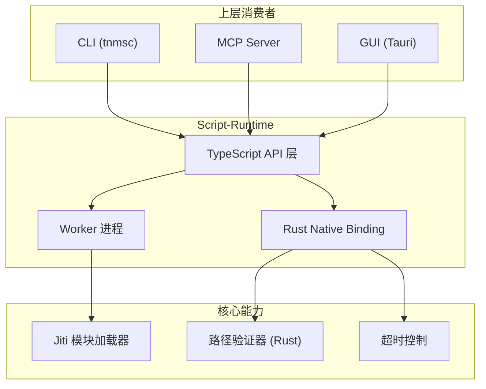
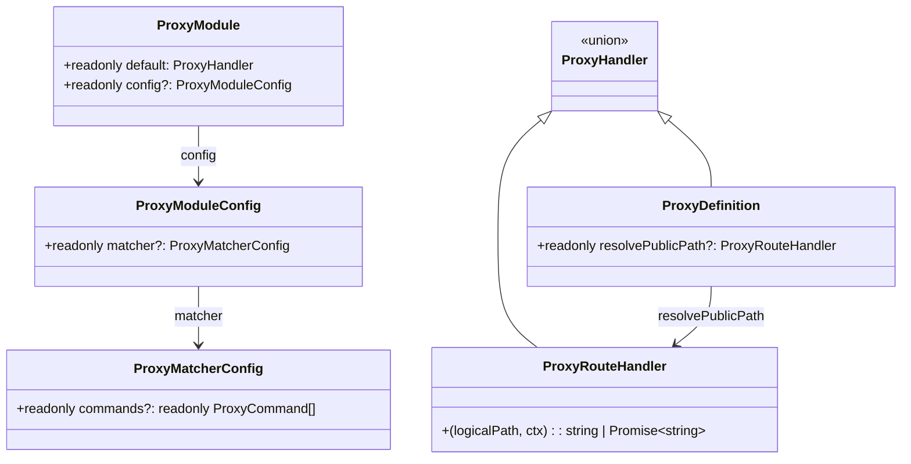
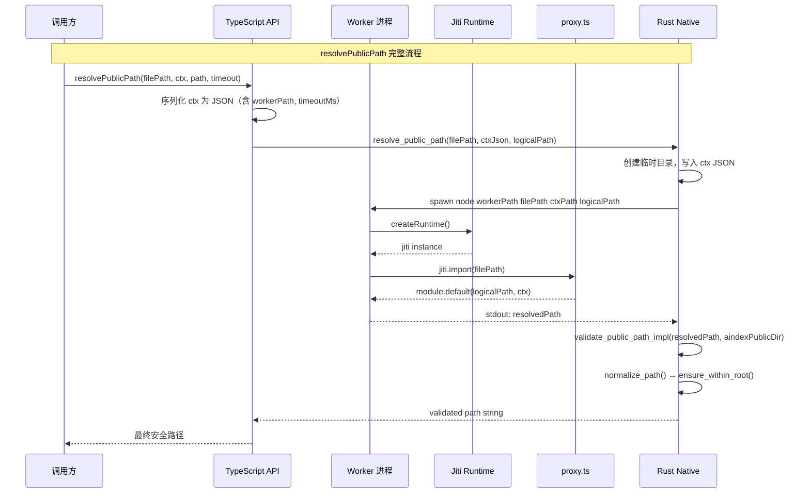
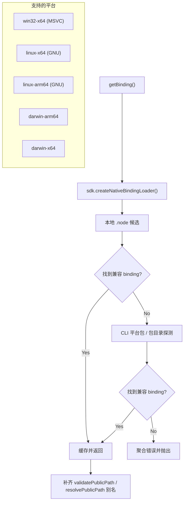
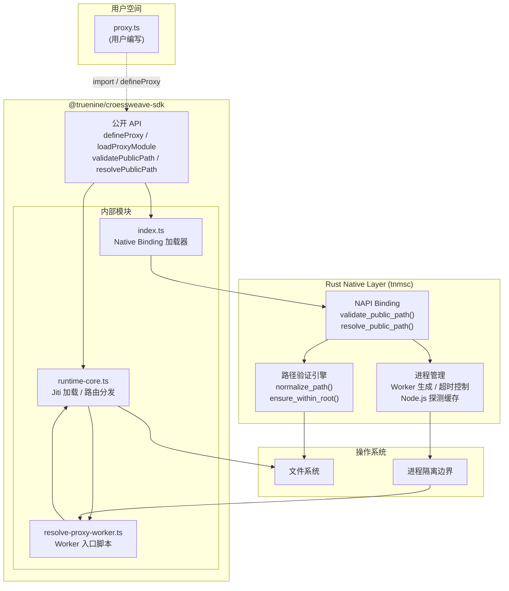

import { Callout, Cards, Steps, Tabs } from 'nextra/components'

# Script-Runtime

<Callout type="info">
**包名**: `@truenine/croessweave-sdk` &nbsp;|&nbsp; **Rust Crate**: `tnmsc` &nbsp;|&nbsp; **Rust 源码位置**: `sdk/src/native_script_runtime.rs` &nbsp;|&nbsp; **TypeScript facade**: `sdk/src/libraries/script-runtime/`
</Callout>

Script-Runtime 是一个 **Rust 支持的 TypeScript 代理模块加载器和路径验证运行时**，为 `tnmsc` 核心系统提供安全的动态模块代理与公共路径解析能力。它通过 NAPI 将 Rust 原生的高性能路径验证逻辑暴露给 Node.js 层，同时利用 Jiti 运行时实现灵活的代理模块加载与执行。

## 库概述

### 定位与核心价值

Script-Runtime 在 `tnmsc` 架构中扮演 **基础设施层** 的角色：

- **代理模块加载器**: 动态加载和执行用户定义的 `proxy.ts` 模块
- **路径安全守卫**: 通过 Rust 原生绑定实现防路径遍历的严格路径验证
- **沙箱执行环境**: 使用 Worker 进程隔离代理模块执行，支持超时控制



### 应用场景

| 场景 | 说明 |
| --- | --- |
| **CLI 动态代理** | `tnmsc install` / `dry-run` 时按需加载项目级 `proxy.ts` |
| **MCP 工具集成** | MCP Server 通过 Script-Runtime 解析工具请求的公共资源路径 |
| **GUI 路由代理** | Tauri 桌面应用使用代理模块将逻辑路径映射到实际文件系统位置 |
| **沙箱路径解析** | 在受控环境中执行用户自定义路径转换逻辑，防止路径遍历攻击 |

---

## 核心 API 详解

### 导出总览

```typescript
import {
  // 类型导出
  type ProxyCommand,
  type ProxyContext,
  type ProxyDefinition,
  type ProxyMatcherConfig,
  type ProxyModule,
  type ProxyModuleConfig,
  type ProxyRouteHandler,
  type ValidatePublicPathOptions,

  // 函数导出
  defineProxy,
  loadProxyModule,
  validatePublicPath,
  resolvePublicPath,
  resolvePublicPathUnchecked,
  getProxyModuleConfig
} from '@truenine/croessweave-sdk'
```

---

### `defineProxy<T>(definition) → T`

定义一个类型安全的代理模块。这是一个 **身份函数（identity function）**，主要用于提供 TypeScript 类型推断。

**签名:**

```typescript
function defineProxy<T extends ProxyDefinition | ProxyRouteHandler>(value: T): T
```

**参数:**

| 参数 | 类型 | 说明 |
| --- | --- | --- |
| `value` | `T extends ProxyDefinition \| ProxyRouteHandler` | 代理定义对象或路由处理函数 |

**返回值:** `T` — 原样返回输入值，保留完整类型信息

**异常情况:** 无

---

### `loadProxyModule(filePath) → Promise<ProxyModule>`

动态加载一个代理模块文件。内部使用 [Jiti](https://github.com/nicolo-ribaudo/jiti) 运行时实现 TypeScript/ESM 的即时编译与执行。

**签名:**

```typescript
async function loadProxyModule(filePath: string): Promise<ProxyModule>
```

**参数:**

| 参数 | 类型 | 说明 |
| --- | --- | --- |
| `filePath` | `string` | 代理模块文件的绝对或相对路径 |

**返回值:** `Promise<ProxyModule>` — 加载后的代理模块对象

**异常情况:**

| 异常 | 触发条件 |
| --- | --- |
| `Error` | 文件不存在 (`proxy.ts not found: ...`) |
| `Error` | 模块未导出默认值 (`proxy.ts must export a default value`) |
| `TypeError` | 默认导出不是函数或纯对象 (`proxy.ts default export must be a function or plain object`) |
| `Error` | config 导出不是纯对象 (`proxy.ts config export must be a plain object`) |

---

### `validatePublicPath(resolvedPath, options) → string`

通过 Rust 原生绑定验证解析后的公共路径安全性。这是 **同步调用**，直接执行 Rust 层的路径规范化与安全检查。

**签名:**

```typescript
function validatePublicPath(
  resolvedPath: string,
  options: ValidatePublicPathOptions
): string
```

**参数:**

| 参数 | 类型 | 说明 |
| --- | --- | --- |
| `resolvedPath` | `string` | 待验证的已解析路径（相对路径） |
| `options` | `ValidatePublicPathOptions` | 验证选项配置 |

**返回值:** `string` — 验证通过后的规范化相对路径

**异常情况:**

| 异常 | 触发条件 |
| --- | --- |
| `Error` | 路径为空 (`Resolved public path cannot be empty`) |
| `Error` | 路径是绝对路径 (`Resolved public path must be relative`) |
| `Error` | 路径包含 `..` 遍历段 (`Path escapes root`) |
| `Error` | Native binding 不可用 (`validate_public_path native binding is unavailable`) |

---

### `resolvePublicPath(filePath, ctx, logicalPath, timeoutMs?) → string`

**完整的路径解析流程**: 加载代理模块 → 执行路由处理器 → Rust 层安全验证。这是 **同步阻塞调用**，内部通过 Worker 子进程执行代理逻辑并等待结果。

**签名:**

```typescript
function resolvePublicPath(
  filePath: string,
  ctx: ProxyContext,
  logicalPath: string,
  timeoutMs?: number = 5_000
): string
```

**参数:**

| 参数 | 类型 | 默认值 | 说明 |
| --- | --- | --- | --- |
| `filePath` | `string` | — | 代理模块文件路径 |
| `ctx` | `ProxyContext` | — | 代理上下文对象 |
| `logicalPath` | `string` | — | 待解析的逻辑公共路径 |
| `timeoutMs` | `number` | `5000` | Worker 执行超时时间（毫秒） |

**返回值:** `string` — 经过代理转换和安全验证后的最终路径

**异常情况:**

| 异常 | 触发条件 |
| --- | --- |
| `Error` | Worker 执行超时 (`proxy.ts execution timed out after ...ms`) |
| `Error` | 代理模块执行错误（来自 stderr） |
| `Error` | Worker 无输出 (`proxy worker produced no output`) |
| `Error` | 路径验证失败（同 `validatePublicPath`） |
| `Error` | Node.js 可执行文件未找到 |
| `Error` | Worker 路径无效 |

---

### `resolvePublicPathUnchecked(filePath, ctx, logicalPath) → Promise<string>`

**无 Rust 安全检查的异步路径解析**。仅执行代理模块的路由处理逻辑，跳过 Rust 层的路径验证。适用于需要自定义验证策略的场景。

**签名:**

```typescript
async function resolvePublicPathUnchecked(
  filePath: string,
  ctx: ProxyContext,
  logicalPath: string
): Promise<string>
```

**参数:** 同 `resolvePublicPath`，无 `timeoutMs` 参数

**返回值:** `Promise<string>` — 代理模块返回的原始解析路径

**异常情况:** 同 `loadProxyModule` 和路由处理器可能抛出的异常

---

### `getProxyModuleConfig(module) → ProxyModuleConfig | undefined`

从已加载的代理模块中提取配置信息。

**签名:**

```typescript
function getProxyModuleConfig(module: ProxyModule): ProxyModuleConfig | undefined
```

**参数:**

| 参数 | 类型 | 说明 |
| --- | --- | --- |
| `module` | `ProxyModule` | 已加载的代理模块实例 |

**返回值:** `ProxyModuleConfig | undefined` — 模块配置，若模块未导出 config 则为 `undefined`

---

## 关键类型详解

### `ProxyContext`

代理执行的上下文环境，包含当前工作状态和目标信息。

```typescript
interface ProxyContext {
  readonly cwd: string           // 当前工作目录
  readonly workspaceDir: string   // 工作区根目录
  readonly aindexDir: string      // Aindex 数据目录
  readonly command: ProxyCommand  // 当前执行的命令
  readonly platform: NodeJS.Platform  // 运行平台
}
```

<Callout type="warning">
`ProxyContext` 的所有属性均为 `readonly`，代理模块不应修改上下文对象。
</Callout>

### `ValidatePublicPathOptions`

路径验证选项配置。

```typescript
interface ValidatePublicPathOptions {
  readonly aindexPublicDir: string  // Aindex 公共资源根目录，用作安全边界
}
```

### `ProxyCommand`

支持的代理命令类型枚举。

```typescript
type ProxyCommand = 'install' | 'dry-run' | 'clean' | 'plugins'
```

### `ProxyMatcherConfig`

命令匹配器配置，用于控制代理模块在哪些命令下生效。

```typescript
interface ProxyMatcherConfig {
  readonly commands?: readonly ProxyCommand[]  // 生效的命令列表，空或未设置表示全部生效
}
```

### `ProxyModule` / `ProxyModuleConfig` / `ProxyDefinition` / `ProxyRouteHandler`

```typescript
// 代理模块的完整结构
interface ProxyModule {
  readonly default: ProxyHandler          // 默认导出：函数或定义对象
  readonly config?: ProxyModuleConfig     // 可选的模块配置
}

// 模块配置
interface ProxyModuleConfig {
  readonly matcher?: ProxyMatcherConfig   // 命令匹配器
}

// 代理定义对象形式
interface ProxyDefinition {
  readonly resolvePublicPath?: ProxyRouteHandler  // 路径解析处理器
}

// 路由处理函数签名
type ProxyRouteHandler = (
  logicalPath: string,
  ctx: ProxyContext
) => string | Promise<string>
```

---

## 代理系统架构

### 代理定义模式

Script-Runtime 支持两种代理定义方式：

<Cards>
<Cards.Card title="函数式定义" href="/docs/sdk/script-runtime#代理定义模式" icon="⚡">
推荐用于简单场景，直接导出一个路由处理函数。
</Cards.Card>
<Cards.Card title="对象式定义" href="/docs/sdk/script-runtime#代理定义模式" icon="📦">
适用于需要组织多个处理器或未来扩展的场景，导出包含 `resolvePublicPath` 的对象。
</Cards.Card>
</Cards>

<Tabs items={["函数式", "对象式"]}>
<Tabs.Tab>
```typescript
// proxy.ts - 函数式定义
import {defineProxy} from '@truenine/croessweave-sdk'
import {join} from 'node:path'

export default defineProxy((logicalPath: string, ctx: ProxyContext) => {
  return join('assets', logicalPath)
})
```
</Tabs.Tab>
<Tabs.Tab>
```typescript
// proxy.ts - 对象式定义
import {defineProxy, type ProxyDefinition} from '@truenine/croessweave-sdk'
import {join} from 'node:path'

const proxy: ProxyDefinition = {
  resolvePublicPath(logicalPath: string, ctx: ProxyContext) {
    return join('static', ctx.platform, logicalPath)
  }
}

export default defineProxy(proxy)

export const config = {
  matcher: {
    commands: ['install', 'dry-run']
  }
}
```
</Tabs.Tab>
</Tabs>

### ProxyModule 结构



### 模块加载流程

`loadProxyModule` 的内部执行步骤：

<Steps>
### 1. 路径解析

将输入路径转换为绝对路径，并验证文件存在性。

### 2. Jiti 运行时创建

创建一个新的 Jiti 实例，配置如下：
- `fsCache: false` — 禁用文件系统缓存，确保每次加载最新版本
- `moduleCache: false` — 禁用模块缓存，避免跨调用状态污染
- `interopDefault: false` — 禁用默认互操作，保留原始导出结构

### 3. 模块导入

使用 Jiti 的 `import()` 方法加载目标文件，支持 TypeScript 和 ESM 语法。

### 4. 结构验证

对加载的模块进行严格的类型校验：
- 必须是对象（模块命名空间）
- 必须包含 `default` 导出
- `default` 必须是函数或纯对象
- `config`（如果存在）必须是纯对象

### 5. 返回 ProxyModule

构造并返回符合 `ProxyModule` 接口的结构化对象。
</Steps>

---

## 路径解析机制

### validatePublicPath vs resolvePublicPath

这两个 API 的设计反映了 **"验证 vs 完整流程"** 的职责分离：

| 特性 | `validatePublicPath` | `resolvePublicPath` |
| --- | --- | --- |
| **性质** | 同步、纯验证 | 同步、完整流程 |
| **Rust 绑定** | ✅ 直接调用 | ✅ 内部调用 |
| **代理执行** | ❌ 不执行 | ✅ 通过 Worker 执行 |
| **超时控制** | ❌ 无 | ✅ 支持 |
| **适用场景** | 已有路径的安全校验 | 端到端路径解析 |



### Native Binding 层的角色

Rust 实现的路径验证提供了 **操作系统级别的安全保障**：

1. **路径规范化**: 统一处理 `/`、`\`、`.`、`..` 等路径组件
2. **遍历检测**: 通过逐组件解析检测 `..` 是否逃逸出允许的根目录
3. **绝对路径拒绝**: 强制要求相对路径，防止绝对路径注入
4. **空路径防护**: 拒绝空字符串和纯空白路径

### Worker 机制

`resolve-proxy-worker.ts` 是一个独立的 Node.js 脚本，作为子进程运行：

```
Usage: resolve-proxy-worker <file-path> <ctx-json-path> <logical-path>
```

**工作流程:**
1. 从命令行参数读取文件路径、上下文 JSON 路径和逻辑路径
2. 读取并解析上下文 JSON 文件
3. 调用 `resolvePublicPathModule` 执行代理逻辑
4. 将结果写入 stdout，错误写入 stderr 并以退出码 1 退出

### 超时控制和安全边界

<Callout type="warning">
**超时机制**: Rust 层使用 `wait_timeout::ChildExt` 实现，超时后强制终止 Worker 进程（`child.kill()`），防止恶意或失控的代理模块无限期挂起。
</Callout>

| 安全措施 | 实现层 | 说明 |
| --- | --- | --- |
| 超时终止 | Rust | 默认 5000ms，可配置 |
| 路径遍历防护 | Rust | `normalize_path` + `ensure_within_root` |
| 绝对路径拒绝 | Rust | `candidate_path.is_absolute()` 检查 |
| 模块缓存禁用 | TypeScript (Jiti) | 每次 `loadProxyModule` 创建新实例 |
| 进程隔离 | OS | Worker 作为独立子进程运行 |

---

## Native Binding 层详解

### Rust 核心实现

`lib.rs` 包含两个核心函数：

#### `validate_public_path_impl`

```rust
pub fn validate_public_path_impl(
    resolved_path: &str,
    aindex_public_dir: &str,
) -> Result<String, String>
```

**算法步骤:**
1. 去除首尾空白，检查非空
2. 统一反斜杠为正斜杠
3. 拒绝绝对路径
4. 调用 `normalize_path()` 规范化路径组件
5. 计算公共目录的绝对基路径
6. 拼接后再次规范化
7. 调用 `ensure_within_root()` 验证不逃逸

#### `resolve_public_path_impl`

```rust
pub fn resolve_public_path_impl(
    file_path: &str,
    ctx_json: &str,
    logical_path: &str,
) -> Result<String, String>
```

**算法步骤:**
1. 反序列化 JSON 上下文（提取 `worker_path`、`timeout_ms`、`aindex_dir`）
2. 检测 Node.js 可执行文件（带缓存）
3. 创建临时目录并写入上下文 JSON
4. 生成 Worker 子进程
5. 等待执行完成（带超时）
6. 读取 stdout/stderr
7. 对输出调用 `validate_public_path_impl` 进行安全验证

### 共享 Native Binding 加载

Script-Runtime 现在与 Logger、MDX-Compiler 共用 `sdk/src/core/native-binding-loader.ts`。它的 TypeScript facade 位于 `sdk/src/libraries/script-runtime/`，而 `sdk/src/libraries/script-runtime/index.ts` 保留 wrapper 角色；真正的实现只保留 Script-Runtime 自己必须关心的部分：

- `isScriptRuntimeBinding()`：校验 native export
- `optionalMethods` 映射：把 `validate_public_path` / `resolve_public_path` 归一成 TypeScript 侧的首选方法名
- Worker 入口文件的查找逻辑：这是运行时特有行为，不能抽到通用加载器里



共享加载器会按统一顺序探测源码旁、`dist/`、`npm/<suffix>/` 和 CLI 平台包中的 `.node` 制品，而 Script-Runtime 本地代码则继续专注于 Worker 路径发现与 API 兼容层。

### 与 TypeScript 层的数据交互

数据流通过 **JSON 序列化** 跨越 Rust/TypeScript 边界：

```mermaid
LR
    subgraph TypeScript["TypeScript 层"]
        CTX_OBJ["ProxyContext 对象"]
        JSON_STR["JSON 字符串"]
    end

    subgraph Rust["Rust 层"]
        CTX_STRUCT["ResolvePublicPathContext struct"]
        RESULT_STR["Result&lt;String&gt;"]
    end

    CTX_OBJ --> "|JSON.stringify()"| JSON_STR
    JSON_STR --> "|NAPI 参数传递"| CTX_STRUCT
    CTX_STRUCT --> "|serde 反序列化"| CTX_STRUCT
    CTX_STRUCT --> "|处理逻辑"| RESULT_STR
    RESULT_STR --> "|NAPI 返回值"| JSON_STR
```

---

## 使用示例

### 示例 1: 定义简单的代理模块

```typescript
// project/proxy.ts
import {defineProxy, type ProxyRouteHandler} from '@truenine/croessweave-sdk'

const handler: ProxyRouteHandler = (logicalPath) => {
  // 简单的前缀映射
  return `public/${logicalPath}`
}

export default defineProxy(handler)
```

### 示例 2: 加载和使用外部代理

```typescript
import {loadProxyModule, getProxyModuleConfig} from '@truenine/croessweave-sdk'

async function useExternalProxy(proxyPath: string) {
  // 加载代理模块
  const module = await loadProxyModule(proxyPath)

  // 获取模块配置
  const config = getProxyModuleConfig(module)
  console.log('Matcher commands:', config?.matcher?.commands)

  // 直接调用默认导出的处理器（如果是函数形式）
  if (typeof module.default === 'function') {
    const result = await module.default('styles/main.css', {
      cwd: process.cwd(),
      workspaceDir: '/path/to/workspace',
      aindexDir: '/path/to/.aindex',
      command: 'install',
      platform: process.platform
    })
    console.log('Resolved:', result)
  }
}

useExternalProxy('./project/proxy.ts')
```

### 示例 3: 公共路径验证

```typescript
import {validatePublicPath} from '@truenine/croessweave-sdk'

const options = {aindexPublicDir: '/workspace/.aindex/public'}

// ✅ 合法的相对路径
const valid = validatePublicPath('assets/images/logo.png', options)
console.log(valid) // "assets/images/logo.png"

try {
  // ❌ 绝对路径 - 会抛出错误
  validatePublicPath('/etc/passwd', options)
} catch (error) {
  console.error('Rejected absolute path:', error.message)
}

try {
  // ❌ 路径遍历 - 会抛出错误
  validatePublicPath('../../secret.txt', options)
} catch (error) {
  console.error('Rejected traversal:', error.message)
}

try {
  // ❌ 包含反斜杠的父目录引用
  validatePublicPath('safe\\..\\..\\escape', options)
} catch (error) {
  console.error('Rejected backslash traversal:', error.message)
}
```

### 示例 4: 带上下文的路径解析

```typescript
import {resolvePublicPath} from '@truenine/croessweave-sdk'

const ctx = {
  cwd: '/home/user/project',
  workspaceDir: '/home/user/project',
  aindexDir: '/home/user/project/.aindex',
  command: 'install' as const,
  platform: process.platform
}

// 完整的端到端解析（同步，带超时保护）
try {
  const result = resolvePublicPath(
    './proxy.ts',     // 代理模块路径
    ctx,              // 代理上下文
    'scripts/app.js', // 逻辑路径
    10_000            // 自定义超时 10 秒
  )
  console.log('Safely resolved:', result)
} catch (error) {
  if (error.message.includes('timed out')) {
    console.error('代理模块执行超时')
  } else {
    console.error('路径解析失败:', error.message)
  }
}
```

### 示例 5: 完整的代理路由配置（含 matchers 和 handlers）

```typescript
// project/proxy.ts - 生产级代理模块
import {
  defineProxy,
  type ProxyDefinition,
  type ProxyRouteHandler,
  type ProxyContext,
  type ProxyModuleConfig
} from '@truenine/croessweave-sdk'
import {join, extname} from 'node:path'

/**
 * 根据文件扩展名选择不同的路径映射策略
 */
const resolveHandler: ProxyRouteHandler = async (
  logicalPath: string,
  ctx: ProxyContext
): Promise<string> => {
  const ext = extname(logicalPath)

  switch (ext) {
    case '.ts':
    case '.tsx':
    case '.js':
    case '.jsx':
      // 脚本文件映射到 dist 目录
      return join('dist', logicalPath)

    case '.css':
    case '.less':
    case '.scss':
      // 样式文件映射到 assets/styles
      return join('assets', 'styles', logicalPath)

    case '.png':
    case '.jpg':
    case '.svg':
    case '.webp':
      // 图片资源根据平台分目录
      return join('assets', 'images', ctx.platform, logicalPath)

    default:
      // 其他文件保持原路径
      return logicalPath
  }
}

const definition: ProxyDefinition = {
  resolvePublicPath: resolveHandler
}

export default defineProxy(definition)

export const config: ProxyModuleConfig = {
  matcher: {
    // 仅在 install 和 dry-run 命令下生效
    commands: ['install', 'dry-run']
  }
}
```

**消费端使用:**

```typescript
import {resolvePublicPath, loadProxyModule, getProxyModuleConfig} from '@truenine/croessweave-sdk'

async function demonstrateFullProxy() {
  const ctx = {
    cwd: process.cwd(),
    workspaceDir: process.cwd(),
    aindexDir: join(process.cwd(), '.aindex'),
    command: 'install' as const,
    platform: process.platform
  }

  // 方式一：使用完整的 resolvePublicPath（含 Rust 安全验证）
  const scriptPath = resolvePublicPath('./project/proxy.ts', ctx, 'utils/helper.ts')
  console.log('Script path:', scriptPath)
  // 输出类似: "dist/utils/helper.ts"

  const imagePath = resolvePublicPath('./project/proxy.ts', ctx, 'logo.png')
  console.log('Image path:', imagePath)
  // 输出类似: "assets/images/linux-x64/logo.png"

  // 方式二：先加载模块查看配置
  const module = await loadProxyModule('./project/proxy.ts')
  const moduleConfig = getProxyModuleConfig(module)
  console.log('Active commands:', moduleConfig?.matcher?.commands)
  // 输出: ["install", "dry-run"]
}
```

---

## 最佳实践

### 代理模块的项目结构建议

```
project/
├── proxy.ts              # 代理模块入口（必须）
├── src/
│   └── resolvers/        # 自定义解析器（可选）
│       ├── asset-resolver.ts
│       └── path-utils.ts
└── tsconfig.json         # TypeScript 配置（可选）
```

<Callout type="tip">
**建议**: 将复杂的路径解析逻辑拆分为独立模块，在 `proxy.ts` 中仅做聚合和导出。这样有利于测试和维护。
</Callout>

### 错误处理和超时配置

```typescript
import {resolvePublicPath, loadProxyModule} from '@truenine/croessweave-sdk'

class ProxyResolutionError extends Error {
  constructor(
    message: string,
    public readonly phase: 'load' | 'execute' | 'validate',
    public readonly cause?: Error
  ) {
    super(message)
    this.name = 'ProxyResolutionError'
  }
}

async function safeResolve(
  proxyPath: string,
  ctx: Parameters<typeof resolvePublicPath>[1],
  logicalPath: string
): Promise<string> {
  try {
    // 预检：确保代理模块可以正常加载
    await loadProxyModule(proxyPath)
  } catch (error) {
    throw new ProxyResolutionError(
      `无法加载代理模块: ${proxyPath}`,
      'load',
      error instanceof Error ? error : undefined
    )
  }

  try {
    // 正式解析（带合理的超时）
    return resolvePublicPath(proxyPath, ctx, logicalPath, 15_000)
  } catch (error) {
    const message = error instanceof Error ? error.message : String(error)
    if (message.includes('timed out')) {
      throw new ProxyResolutionError(
        `代理模块执行超时: ${proxyPath}`,
        'execute',
        error instanceof Error ? error : undefined
      )
    }
    throw new ProxyResolutionError(
      `路径验证失败: ${message}`,
      'validate',
      error instanceof Error ? error : undefined
    )
  }
}
```

### 安全注意事项

<Callout type="danger">
**关键安全原则**: 永远不要绕过 `validatePublicPath` 或信任 `resolvePublicPathUnchecked` 的输出用于敏感操作。
</Callout>

| 风险 | 防护措施 |
| --- | --- |
| **路径遍历攻击** | Rust 层的 `normalize_path` + `ensure_within_root` 双重防护 |
| **绝对路径注入** | Rust 层拒绝所有绝对路径 |
| **代理模块失控** | Worker 超时机制（默认 5s，可配置） |
| **模块状态污染** | Jiti 每次创建新实例，禁用模块缓存 |
| **恶意代理代码** | 进程隔离 + stderr 捕获 + 错误传播 |

**禁止模式:**

```typescript
// ❌ 错误：直接使用 unchecked 结果访问文件系统
import {readFile} from 'node:fs/promises'
import {resolvePublicPathUnchecked} from '@truenine/croessweave-sdk'

const unsafePath = await resolvePublicPathUnchecked(proxyPath, ctx, userInput)
const content = await readFile(unsafePath, 'utf8') // 危险！未经验证

// ✅ 正确：始终经过验证
import {resolvePublicPath} from '@truenine/croessweave-sdk'
import {readFile} from 'node:fs/promises'

const safePath = resolvePublicPath(proxyPath, ctx, userInput) // 含 Rust 验证
const content = await readFile(join(publicRoot, safePath), 'utf8') // 安全
```

### 性能优化建议

<Steps>
### 1. Worker 路径缓存

`getWorkerPath()` 内部实现了路径查找结果的缓存，首次调用后会缓存找到的 Worker 路径，后续调用直接返回。

### 2. Native Binding 缓存

`getBinding()` 实现了单例模式的 binding 加载，首次成功加载后缓存实例，后续调用直接复用。加载失败也会缓存错误，避免重复尝试。

### 3. Node.js 可执行文件检测缓存

Rust 层使用 `OnceLock<Mutex<Option<OsString>>>` 缓存 Node.js 路径检测结果，避免每次 `resolve_public_path` 都重新探测。

### 4. 合理设置超时

根据代理模块复杂度调整超时时间：
- 简单代理: `3000ms` (默认 5000ms 通常足够)
- 复杂代理（涉及网络请求等）: `10000ms` ~ `30000ms`
- 避免设置过长超时（如 >60000ms），这会降低系统响应性

### 5. 批量解析优化

当需要解析大量路径时，考虑在一次代理调用中批量处理：

```typescript
// ✅ 推荐：批量解析
const batchHandler: ProxyRouteHandler = (logicalPath, _ctx) => {
  // logicalPath 可能是逗号分隔的多个路径
  return logicalPath.split(',').map(p => `assets/${p}`).join(',')
}
```
</Steps>

---

## 架构总结



---

## 相关资源

- **Rust 源码位置**: `sdk/src/native_script_runtime.rs`
- **TypeScript facade**: `sdk/src/libraries/script-runtime/`
- **主入口**: `sdk/src/libraries/script-runtime/index.ts`
- **类型定义**: `sdk/src/libraries/script-runtime/types.ts`
- **核心运行时**: `sdk/src/libraries/script-runtime/runtime-core.ts`
- **Worker 处理器**: `sdk/src/libraries/script-runtime/resolve-proxy-worker.ts`
- **Rust Native**: `sdk/src/native_script_runtime.rs`
- **依赖库**: `logger`（类似的 Native Binding 模式参考）
